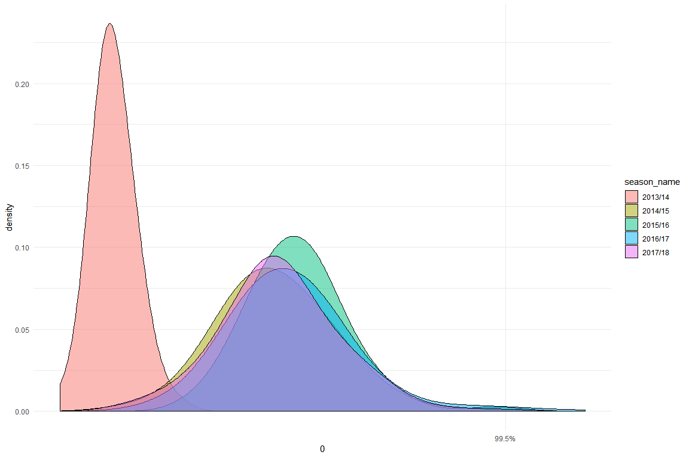
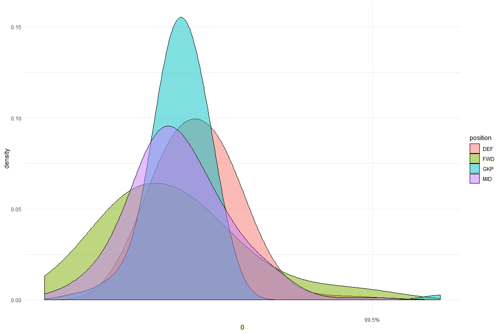
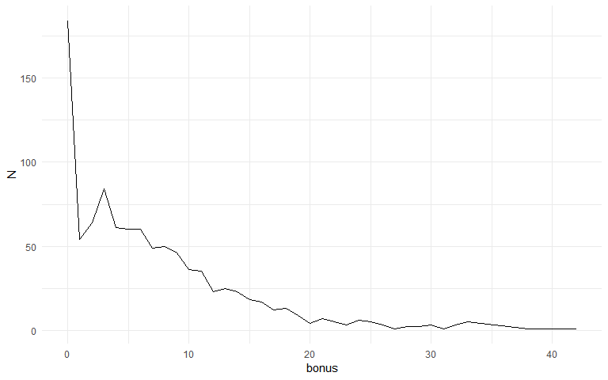
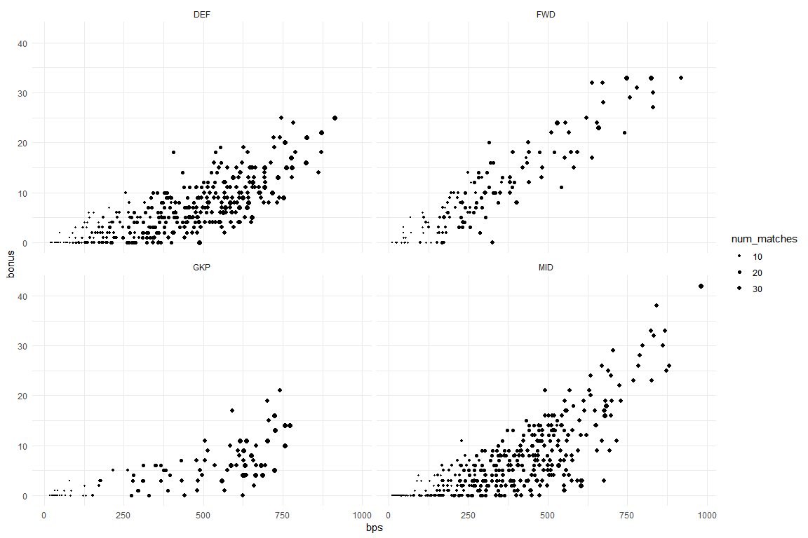
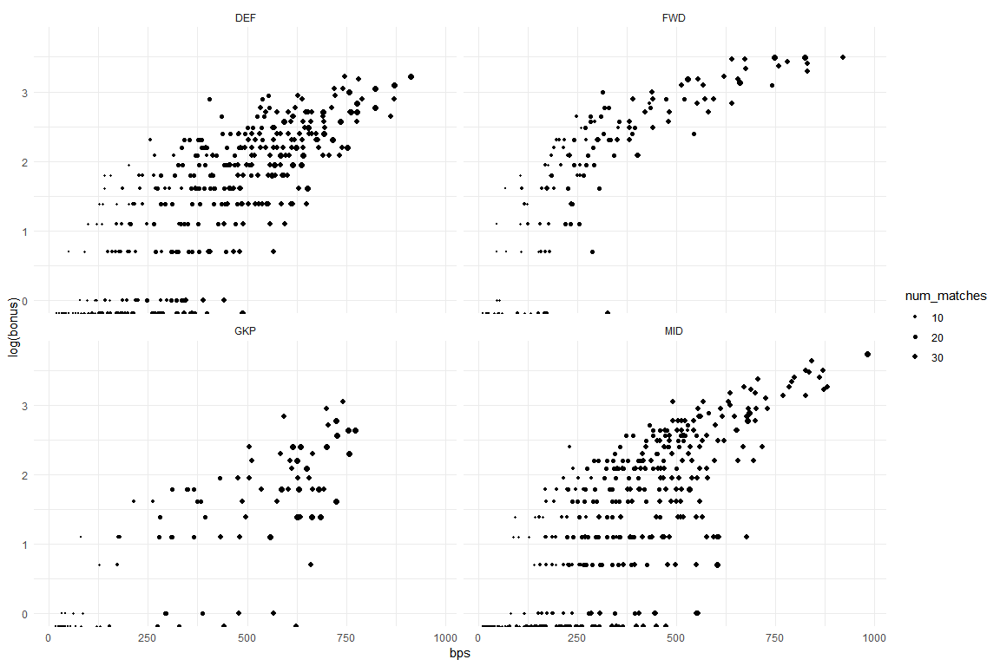
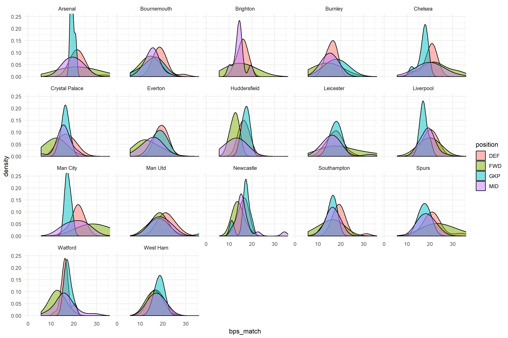
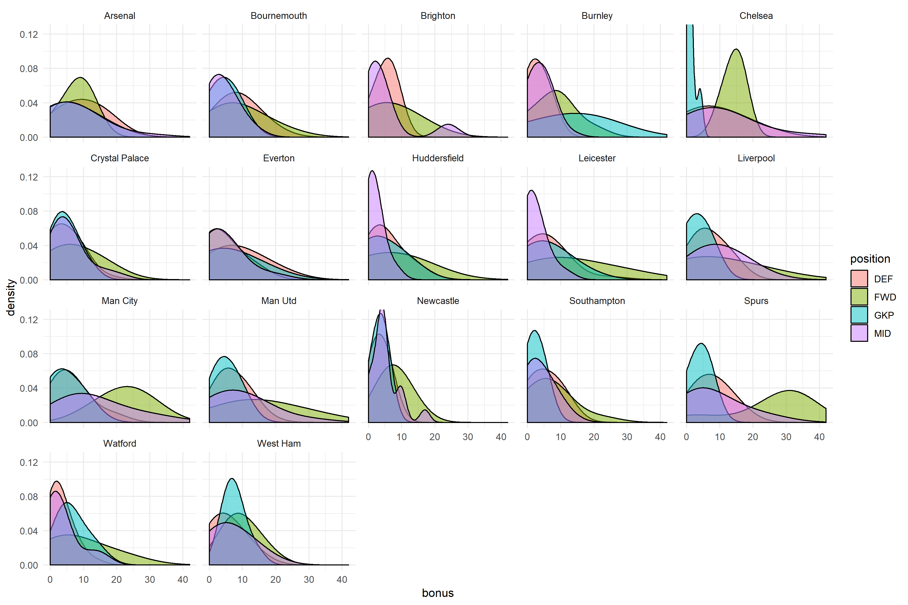
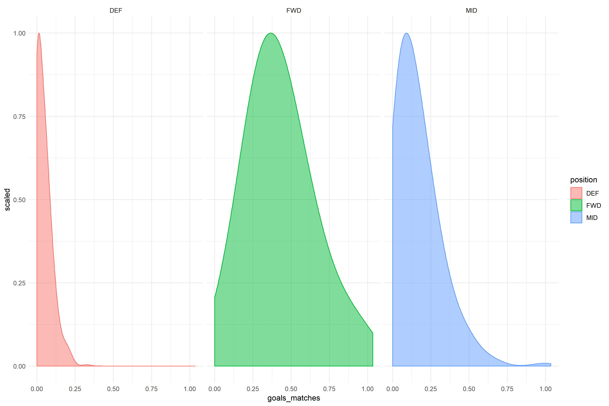
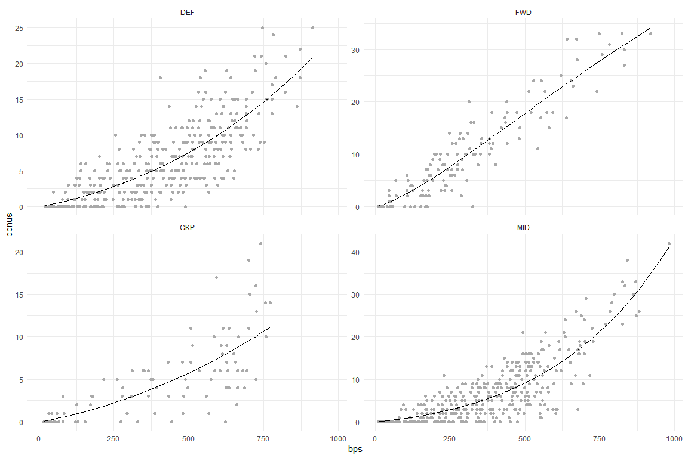
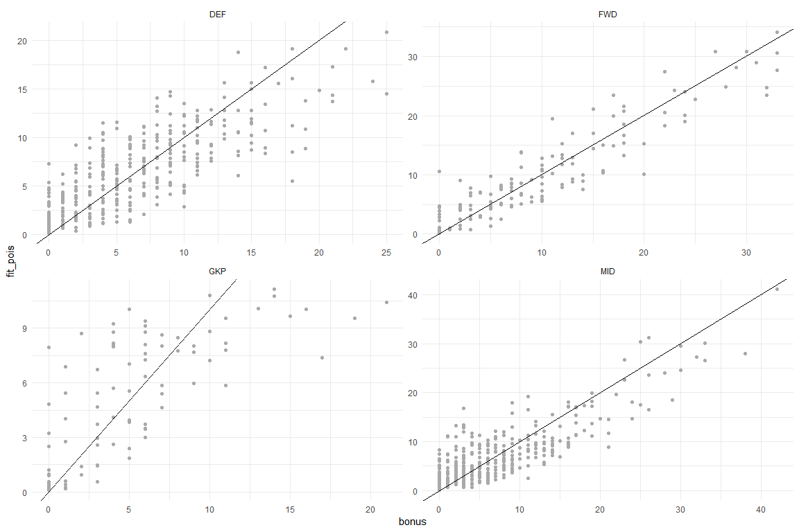

## Overview

In this post, I am going to look at predicting the number of bonus points that a player will accrue throughout the 2017 FPL season. In each Fixture, bonus points of (3,2,1) are given out to the best 3 performing players. It is rule based with the current version found at <https://www.premierleague.com/news/106533>.

From the FPL website I can only find information about existing players and their
history. Some challenges I face:

* Can only see a player's current team e.g. Xherdan Shaqiri will be presented 
as a Liverpool player in the 2017/18 data, despite playing for Stoke
* By not having old FPL players, each previous season will have less valuable 
information as we have less players available
* Don't have in depth fixture data, which makes inference more challenging
* Bonus points system is position dependent, so any model would need to 
account for this. Unfortunately not all the metrics that make up the bonus
points is available in the data. Will need to make some assumptions about the
underlying distribution of bonus points.

## Data Exploration

### Setup
Data is stored in my Github repo `fpl-analytics`. This can be installed below


```r
library(devtools)
install_github("jphelps13/fpl.analytics")
```

For this tutorial please make sure you have installed the following packages.
I will be using `data.table` for managing the data.


```r
# Github
library(fpl.analytics)

# CRAN
library(DT) # html tables
library(data.table) # data management
library(MASS) # negative binomial glm
library(ggplot2) # plotting tool
library(stringi) # removing special characters from names
library(pscl) # zero inflated glms
library(rvest) # pluck
library(psych) # headTails
```

### Get Data
Some manipulation is required from the stored raw data to get a view of 
all previous seasons for existing players. Function to create is stored in the 
github package.


```r
# collects the data from fpl.analytics for the vignette
# special characters in player names have been translated to english for ease of use
dt <- extractBpsData(fpl_player_hist, fpl_season_json) 
head(dt, 3)
```

```
##    player_key season_name start_cost end_cost total_points minutes
## 1:          1     2006/07         65       64           98    1714
## 2:          1     2007/08         65       65          120    2313
## 3:          1     2008/09         60       60          171    3150
##    goals_scored assists clean_sheets goals_conceded own_goals
## 1:            0       0            0              9         0
## 2:            0       0            0             17         0
## 3:            0       0            0             24         0
##    penalties_saved penalties_missed yellow_cards red_cards saves bonus bps
## 1:               0                0            1         0    58     1   0
## 2:               0                0            0         0    60     2   0
## 3:               1                0            0         0    87     7   0
##    influence creativity threat ict_index ea_index player_name    team
## 1:       0.0        0.0    0.0       0.0        0   Petr Cech Arsenal
## 2:       0.0        0.0    0.0       0.0        0   Petr Cech Arsenal
## 3:       0.0        0.0    0.0       0.0        0   Petr Cech Arsenal
##    position
## 1:      GKP
## 2:      GKP
## 3:      GKP
```

```r
# Some seasons don't have any "bps" data, so I will remove this and inactive rows
dt <- dt[bps > 0,]
dt <- dt[minutes > 90] # at least one game
# remove newly promoted teams
check_time <- dt[, .(minutes = sum(minutes)), keyby = team]
print(check_time[minutes < 11*90*38, team])
```

```
## [1] "Cardiff" "Fulham"  "Wolves"
```

```r
check_time <- check_time[minutes > 11*90*38,]
dt <- dt[team %in% check_time$team,]

# Currently working with minutes, going to change this to number of games, and make
# some standardised variables
dt[, num_matches := minutes/90]
dt[, bps_match := bps/num_matches]
dt[, start_cost := start_cost/10] # price reported as 10* game value
dt[, end_cost := end_cost/10]

# check by season - can see that 2013/14 is an anomaly, and so, remove
qu <- quantile(dt$bps_match, 0.995)
ggplot() + geom_density(data=dt, aes(x=bps_match, group=season_name, fill=season_name),
               alpha=0.5, adjust=2) + theme_minimal() + scale_x_continuous(0, qu)
```

<!-- -->

```r
dt <- dt[season_name != "2013/14",]

# check by position - the distribution for Goalkeepers is much tighter than
# that for the others. The variance for Forwards is the greatest 
ggplot() + geom_density(data=dt, aes(x=bps_match, group=position, fill=position),
               alpha=0.5, adjust=2) + theme_minimal() + scale_x_continuous(0, qu)
```

<!-- -->


### Poisson assumptions
For count data, a Poisson distribution is usually appropriate. The challenge
we have is that we don't have individual `bps` results for each game, which
means we can't see the underlying distribution of the data. The sum of independent
poisson distributions is also Poisson [(source)](https://proofwiki.org/wiki/Sum_of_Independent_Poisson_Random_Variables_is_Poisson), with equal mean and variance. 

Some other models/variations that may be appropriate:
* Negative binomial regression - if data is overdispersed ie Variance is greater than 
the mean, then this distribution is more suitable. [more information](https://stats.idre.ucla.edu/r/dae/negative-binomial-regression/)
* Zero-inflation model - As bonus points are only given to 3 players per match, and the rule base system is weighted in favour of certain events e.g. scoring a goal or saving a penalty, we could expect a class of players to be less likely to get any points.


```r
# check mean & variance, within position
check_poisson <- dt[, .(mu = mean(bps_match), var = var(bps_match)),
                    by = position]
check_poisson[]
```

```
##    position       mu      var
## 1:      GKP 17.59105 10.28901
## 2:      DEF 19.01638 12.72020
## 3:      MID 17.37272 17.82786
## 4:      FWD 16.92351 36.00356
```

```r
# check zero's in the final bonus metric. There are quite a lot
check_zeros <- dt[, .N, keyby = bonus]
ggplot(check_zeros, aes(x = bonus, y = N))+ geom_line() + theme_minimal()
```

<!-- -->

### Variables of interest


```r
# look at overall bps v final bonus score. Can see that its a lot more linear
# for Forwards, than for other players e.g. goalkeepers.
ggplot(dt, aes(x = bps, y = bonus, size = num_matches)) + facet_wrap(~position) + geom_point() +
   scale_size_continuous(range = c(0,2)) + theme_minimal()
```

<!-- -->

```r
ggplot(dt, aes(x = bps, y = log(bonus), size = num_matches)) + facet_wrap(~position) + geom_point() +
   scale_size_continuous(range = c(0,2)) + theme_minimal()
```

<!-- -->


```r
# visualise distributions of bps_match by position and team. 
ggplot() + geom_density(data=dt, aes(x=bps_match, group=position, fill=position),
               alpha=0.5, adjust=2) + theme_minimal() + facet_wrap(~team) + 
  coord_cartesian(xlim = c(0, qu), ylim = c(0, 0.25))
```

<!-- -->

We can see some interesting differences in the average bps per match for some
of the teams above. E.g. Man City and Spurs (Tottenham Hotspurs) have Forwards
that get a lot more of their teams share of bonus points, whils they have done
poorly at Everton, Huddersfield and Watford. 


```r
# visualise distributions of final bonus points by position and team. 
ggplot() + geom_density(data=dt, aes(x=bonus, group=position, fill=position),
                        alpha=0.5, adjust=2) + theme_minimal() + facet_wrap(~team) + 
  coord_cartesian(ylim = c(0, 0.125))
```

<!-- -->
When we look at the final bonus 
points though, it doesn't always correlate. The key strikers at the clubs tend
to get more bonus points, as can be seen by the green right tails. For Man Utd,
Defenders receive slightly more bps than players in other positions, but in terms
of bonus points, Midfielders and Strikers receive more. Looking at the bps scoring
system, the highest two valued are "Forwards scoring a goal" & "Midfielders" 
scoring a goal at 24 & 18 respectively. Distribution of goals per match are below, 
scaled and weighted. We would expect that when a Forward scores, the likelihood of
receiving bonus points goes up a lot, compared to matches where they don't score.


```r
dt[, goals_matches := goals_scored/num_matches]

ggplot() + geom_density(data=dt[position != "GKP",], 
                        aes(x=goals_matches, fill = position, colour = position,
                            weight = num_matches, y = ..scaled..),
                        alpha=0.5, adjust=2) + theme_minimal() + facet_wrap(~position)
```

<!-- -->

## Modelling

We don't have all the teams, fixture and bonus point data e.g. we are missing variables like pass completion rates and defensive contributions. If we did, we could try simulating the matches, using Poisson distributions for each event e.g goal, assist. For teams like Man City, they have a lot of high scoring players, so the threshold of bps
required to receive any bonus points is higher than e.g. for Huddersfield. We could assume that the bps follow their own distribution, but we know the variance for Forwards is much higher than that for Goalkeepers. 

A complete model would consider:
* Fixtures & Home/Away effect e.g.quality of play in different circumstances
* Quality of the team e.g. threshold required for receiving bonus points
* Style of play e.g. Defensive or attacking; Formation
* Exposure i.e. amount of game time per match; number of starts
* Position. bps point system is positional dependent
* Transfers, team roster, injuries etc. understanding when a player has low exposure

With the data at hand, I think anything complicated is not appropriate. I've
tried some basic Poisson glm's with linear and non-linear effects for bps on
bonus, by position, and the results aren't too bad. 


```r
# - not using an offset, as the relationship between bonus and bps isn't strictly
#   linear and has an interaction with position
# - can see in plots above, that there is a stronger linear effect for Forwards,
#   whilst more non-linear for the other positions. The log(bps) variable will 
#   capture the linear part.
m_pois <- glm(bonus ~ log(bps):position + bps:position, 
              data = dt, 
              family = poisson(link = "log"))

# glm summary
summary(m_pois)
```

```
## 
## Call:
## glm(formula = bonus ~ log(bps):position + bps:position, family = poisson(link = "log"), 
##     data = dt)
## 
## Deviance Residuals: 
##     Min       1Q   Median       3Q      Max  
## -4.6094  -1.2139  -0.2302   0.9099   4.2059  
## 
## Coefficients:
##                        Estimate Std. Error z value Pr(>|z|)    
## (Intercept)          -5.5508906  0.4398979 -12.619  < 2e-16 ***
## log(bps):positionDEF  1.1563687  0.0883255  13.092  < 2e-16 ***
## log(bps):positionFWD  1.3940967  0.0899821  15.493  < 2e-16 ***
## log(bps):positionGKP  1.1228186  0.0968740  11.591  < 2e-16 ***
## log(bps):positionMID  1.1246359  0.0869822  12.929  < 2e-16 ***
## positionDEF:bps       0.0007720  0.0002447   3.154  0.00161 ** 
## positionFWD:bps      -0.0004710  0.0002571  -1.832  0.06695 .  
## positionGKP:bps       0.0006421  0.0004475   1.435  0.15128    
## positionMID:bps       0.0015489  0.0002202   7.033 2.03e-12 ***
## ---
## Signif. codes:  0 '***' 0.001 '**' 0.01 '*' 0.05 '.' 0.1 ' ' 1
## 
## (Dispersion parameter for poisson family taken to be 1)
## 
##     Null deviance: 6450.1  on 974  degrees of freedom
## Residual deviance: 2015.5  on 966  degrees of freedom
## AIC: 4955.4
## 
## Number of Fisher Scoring iterations: 5
```

```r
# predict
dt$fit_pois <- round(predict(m_pois, type = "response"), 2)
dt$res_pois <- round(dt$bonus - dt$fit_pois, 2)

# visualise bps v bonus, with fit in black
ggplot(dt, aes(x = bps, y = bonus)) + facet_wrap(~position, scales = "free_y") + 
  geom_point(col = "darkgrey") +
  scale_size_continuous(range = c(0,2)) + theme_minimal() +
  geom_line(aes(x = bps, y = fit_pois))
```

<!-- -->

```r
# visualise bonus vs fit, with perfect fit line added in
ggplot(dt, aes(x = bonus, y = fit_pois)) + facet_wrap(~position, scales = "free") + 
  geom_point(col = "darkgrey") +
  scale_size_continuous(range = c(0,2)) + theme_minimal() + 
  geom_abline(intercept = 0, slope = 1)
```

<!-- -->

As expected, there are some issues with the fit:

* Assumes each observation is iid
* Doesn't take in to account the number of matches played

Below, we can analyse the residuals


```r
check_dt <- dt[order(-res_pois), 
                .(season_name, team, position, player_name, 
                  num_matches, bps, bps_match, bonus, fit_pois, res_pois)]
check_dt[, num_matches := round(num_matches, 1)]
check_dt[, bps_match := round(bps_match, 1)]

DT::datatable(check_dt)
```

<!--html_preserve--><div id="htmlwidget-66ade24646bb3232c113" style="width:100%;height:auto;" class="datatables html-widget"></div>
<script type="application/json" data-for="htmlwidget-66ade24646bb3232c113">{"x":{"filter":"none","data":[["1","2","3","4","5","6","7","8","9","10","11","12","13","14","15","16","17","18","19","20","21","22","23","24","25","26","27","28","29","30","31","32","33","34","35","36","37","38","39","40","41","42","43","44","45","46","47","48","49","50","51","52","53","54","55","56","57","58","59","60","61","62","63","64","65","66","67","68","69","70","71","72","73","74","75","76","77","78","79","80","81","82","83","84","85","86","87","88","89","90","91","92","93","94","95","96","97","98","99","100","101","102","103","104","105","106","107","108","109","110","111","112","113","114","115","116","117","118","119","120","121","122","123","124","125","126","127","128","129","130","131","132","133","134","135","136","137","138","139","140","141","142","143","144","145","146","147","148","149","150","151","152","153","154","155","156","157","158","159","160","161","162","163","164","165","166","167","168","169","170","171","172","173","174","175","176","177","178","179","180","181","182","183","184","185","186","187","188","189","190","191","192","193","194","195","196","197","198","199","200","201","202","203","204","205","206","207","208","209","210","211","212","213","214","215","216","217","218","219","220","221","222","223","224","225","226","227","228","229","230","231","232","233","234","235","236","237","238","239","240","241","242","243","244","245","246","247","248","249","250","251","252","253","254","255","256","257","258","259","260","261","262","263","264","265","266","267","268","269","270","271","272","273","274","275","276","277","278","279","280","281","282","283","284","285","286","287","288","289","290","291","292","293","294","295","296","297","298","299","300","301","302","303","304","305","306","307","308","309","310","311","312","313","314","315","316","317","318","319","320","321","322","323","324","325","326","327","328","329","330","331","332","333","334","335","336","337","338","339","340","341","342","343","344","345","346","347","348","349","350","351","352","353","354","355","356","357","358","359","360","361","362","363","364","365","366","367","368","369","370","371","372","373","374","375","376","377","378","379","380","381","382","383","384","385","386","387","388","389","390","391","392","393","394","395","396","397","398","399","400","401","402","403","404","405","406","407","408","409","410","411","412","413","414","415","416","417","418","419","420","421","422","423","424","425","426","427","428","429","430","431","432","433","434","435","436","437","438","439","440","441","442","443","444","445","446","447","448","449","450","451","452","453","454","455","456","457","458","459","460","461","462","463","464","465","466","467","468","469","470","471","472","473","474","475","476","477","478","479","480","481","482","483","484","485","486","487","488","489","490","491","492","493","494","495","496","497","498","499","500","501","502","503","504","505","506","507","508","509","510","511","512","513","514","515","516","517","518","519","520","521","522","523","524","525","526","527","528","529","530","531","532","533","534","535","536","537","538","539","540","541","542","543","544","545","546","547","548","549","550","551","552","553","554","555","556","557","558","559","560","561","562","563","564","565","566","567","568","569","570","571","572","573","574","575","576","577","578","579","580","581","582","583","584","585","586","587","588","589","590","591","592","593","594","595","596","597","598","599","600","601","602","603","604","605","606","607","608","609","610","611","612","613","614","615","616","617","618","619","620","621","622","623","624","625","626","627","628","629","630","631","632","633","634","635","636","637","638","639","640","641","642","643","644","645","646","647","648","649","650","651","652","653","654","655","656","657","658","659","660","661","662","663","664","665","666","667","668","669","670","671","672","673","674","675","676","677","678","679","680","681","682","683","684","685","686","687","688","689","690","691","692","693","694","695","696","697","698","699","700","701","702","703","704","705","706","707","708","709","710","711","712","713","714","715","716","717","718","719","720","721","722","723","724","725","726","727","728","729","730","731","732","733","734","735","736","737","738","739","740","741","742","743","744","745","746","747","748","749","750","751","752","753","754","755","756","757","758","759","760","761","762","763","764","765","766","767","768","769","770","771","772","773","774","775","776","777","778","779","780","781","782","783","784","785","786","787","788","789","790","791","792","793","794","795","796","797","798","799","800","801","802","803","804","805","806","807","808","809","810","811","812","813","814","815","816","817","818","819","820","821","822","823","824","825","826","827","828","829","830","831","832","833","834","835","836","837","838","839","840","841","842","843","844","845","846","847","848","849","850","851","852","853","854","855","856","857","858","859","860","861","862","863","864","865","866","867","868","869","870","871","872","873","874","875","876","877","878","879","880","881","882","883","884","885","886","887","888","889","890","891","892","893","894","895","896","897","898","899","900","901","902","903","904","905","906","907","908","909","910","911","912","913","914","915","916","917","918","919","920","921","922","923","924","925","926","927","928","929","930","931","932","933","934","935","936","937","938","939","940","941","942","943","944","945","946","947","948","949","950","951","952","953","954","955","956","957","958","959","960","961","962","963","964","965","966","967","968","969","970","971","972","973","974","975"],["2017/18","2015/16","2016/17","2014/15","2015/16","2017/18","2015/16","2017/18","2017/18","2017/18","2017/18","2017/18","2015/16","2017/18","2016/17","2015/16","2015/16","2014/15","2014/15","2016/17","2017/18","2016/17","2016/17","2014/15","2014/15","2014/15","2017/18","2016/17","2015/16","2017/18","2016/17","2015/16","2016/17","2017/18","2017/18","2017/18","2016/17","2014/15","2016/17","2016/17","2015/16","2015/16","2017/18","2017/18","2016/17","2014/15","2016/17","2015/16","2016/17","2016/17","2015/16","2017/18","2015/16","2014/15","2014/15","2016/17","2016/17","2015/16","2015/16","2014/15","2014/15","2016/17","2014/15","2015/16","2016/17","2015/16","2016/17","2015/16","2017/18","2016/17","2017/18","2015/16","2017/18","2014/15","2016/17","2017/18","2016/17","2016/17","2017/18","2017/18","2014/15","2017/18","2014/15","2017/18","2016/17","2014/15","2014/15","2016/17","2017/18","2015/16","2016/17","2015/16","2016/17","2015/16","2016/17","2016/17","2014/15","2014/15","2014/15","2015/16","2017/18","2014/15","2017/18","2017/18","2015/16","2017/18","2017/18","2017/18","2016/17","2016/17","2017/18","2014/15","2014/15","2016/17","2015/16","2017/18","2017/18","2017/18","2017/18","2016/17","2015/16","2016/17","2014/15","2015/16","2016/17","2014/15","2017/18","2015/16","2014/15","2016/17","2016/17","2017/18","2015/16","2016/17","2015/16","2015/16","2016/17","2017/18","2017/18","2017/18","2017/18","2017/18","2014/15","2014/15","2014/15","2016/17","2014/15","2015/16","2015/16","2017/18","2017/18","2016/17","2016/17","2016/17","2016/17","2016/17","2016/17","2015/16","2014/15","2014/15","2017/18","2017/18","2014/15","2014/15","2015/16","2017/18","2017/18","2014/15","2014/15","2017/18","2016/17","2014/15","2017/18","2017/18","2015/16","2016/17","2015/16","2014/15","2016/17","2017/18","2015/16","2015/16","2016/17","2016/17","2015/16","2017/18","2017/18","2017/18","2016/17","2015/16","2014/15","2014/15","2017/18","2017/18","2015/16","2016/17","2016/17","2017/18","2015/16","2017/18","2016/17","2017/18","2017/18","2016/17","2017/18","2016/17","2017/18","2017/18","2014/15","2017/18","2015/16","2015/16","2014/15","2014/15","2015/16","2015/16","2015/16","2016/17","2017/18","2017/18","2017/18","2014/15","2015/16","2014/15","2016/17","2014/15","2017/18","2017/18","2016/17","2017/18","2015/16","2017/18","2016/17","2016/17","2014/15","2017/18","2015/16","2015/16","2014/15","2017/18","2014/15","2014/15","2015/16","2015/16","2015/16","2015/16","2015/16","2017/18","2017/18","2016/17","2014/15","2016/17","2015/16","2017/18","2017/18","2014/15","2015/16","2015/16","2015/16","2017/18","2015/16","2017/18","2016/17","2014/15","2014/15","2016/17","2016/17","2017/18","2015/16","2017/18","2017/18","2014/15","2014/15","2017/18","2017/18","2017/18","2016/17","2017/18","2014/15","2017/18","2017/18","2017/18","2016/17","2014/15","2015/16","2015/16","2016/17","2017/18","2017/18","2014/15","2015/16","2015/16","2017/18","2017/18","2014/15","2017/18","2017/18","2017/18","2016/17","2016/17","2014/15","2016/17","2016/17","2017/18","2017/18","2016/17","2016/17","2017/18","2014/15","2016/17","2015/16","2016/17","2017/18","2016/17","2016/17","2016/17","2015/16","2016/17","2016/17","2015/16","2017/18","2017/18","2017/18","2017/18","2015/16","2017/18","2017/18","2017/18","2017/18","2016/17","2016/17","2016/17","2016/17","2014/15","2017/18","2017/18","2014/15","2016/17","2016/17","2014/15","2016/17","2016/17","2015/16","2014/15","2014/15","2015/16","2017/18","2017/18","2014/15","2014/15","2015/16","2017/18","2017/18","2015/16","2015/16","2015/16","2017/18","2017/18","2014/15","2017/18","2015/16","2017/18","2015/16","2016/17","2014/15","2016/17","2016/17","2016/17","2017/18","2017/18","2017/18","2017/18","2014/15","2015/16","2015/16","2017/18","2016/17","2015/16","2017/18","2015/16","2016/17","2017/18","2014/15","2017/18","2014/15","2014/15","2017/18","2015/16","2014/15","2017/18","2015/16","2017/18","2015/16","2016/17","2016/17","2014/15","2015/16","2017/18","2017/18","2017/18","2017/18","2016/17","2017/18","2015/16","2016/17","2017/18","2016/17","2016/17","2016/17","2017/18","2017/18","2017/18","2017/18","2015/16","2017/18","2014/15","2015/16","2016/17","2017/18","2017/18","2015/16","2017/18","2014/15","2016/17","2014/15","2016/17","2017/18","2016/17","2015/16","2014/15","2017/18","2017/18","2016/17","2014/15","2015/16","2015/16","2017/18","2014/15","2016/17","2015/16","2015/16","2014/15","2017/18","2016/17","2014/15","2016/17","2016/17","2017/18","2016/17","2015/16","2016/17","2015/16","2017/18","2016/17","2015/16","2016/17","2017/18","2017/18","2014/15","2014/15","2017/18","2016/17","2017/18","2017/18","2014/15","2017/18","2017/18","2014/15","2015/16","2015/16","2014/15","2017/18","2014/15","2017/18","2016/17","2017/18","2017/18","2017/18","2017/18","2014/15","2016/17","2015/16","2017/18","2016/17","2014/15","2015/16","2014/15","2017/18","2014/15","2017/18","2017/18","2017/18","2014/15","2017/18","2015/16","2014/15","2017/18","2017/18","2016/17","2017/18","2017/18","2015/16","2017/18","2016/17","2017/18","2014/15","2017/18","2017/18","2016/17","2014/15","2017/18","2014/15","2017/18","2015/16","2015/16","2015/16","2014/15","2015/16","2016/17","2017/18","2014/15","2017/18","2017/18","2016/17","2016/17","2014/15","2016/17","2017/18","2017/18","2016/17","2016/17","2016/17","2015/16","2016/17","2017/18","2017/18","2017/18","2015/16","2016/17","2016/17","2014/15","2017/18","2016/17","2016/17","2015/16","2016/17","2016/17","2016/17","2017/18","2017/18","2014/15","2015/16","2016/17","2017/18","2015/16","2014/15","2016/17","2015/16","2017/18","2016/17","2017/18","2017/18","2017/18","2017/18","2015/16","2017/18","2017/18","2016/17","2016/17","2017/18","2015/16","2014/15","2017/18","2017/18","2016/17","2014/15","2017/18","2017/18","2017/18","2017/18","2015/16","2017/18","2017/18","2017/18","2017/18","2016/17","2016/17","2015/16","2017/18","2014/15","2014/15","2015/16","2015/16","2016/17","2017/18","2017/18","2017/18","2014/15","2017/18","2014/15","2017/18","2015/16","2014/15","2017/18","2017/18","2016/17","2016/17","2015/16","2017/18","2015/16","2017/18","2017/18","2014/15","2016/17","2014/15","2016/17","2014/15","2017/18","2017/18","2017/18","2017/18","2017/18","2017/18","2017/18","2017/18","2017/18","2015/16","2015/16","2017/18","2015/16","2017/18","2017/18","2016/17","2016/17","2017/18","2016/17","2014/15","2016/17","2015/16","2016/17","2016/17","2017/18","2016/17","2016/17","2015/16","2014/15","2017/18","2016/17","2016/17","2016/17","2017/18","2016/17","2016/17","2017/18","2016/17","2015/16","2014/15","2015/16","2014/15","2016/17","2015/16","2017/18","2015/16","2014/15","2017/18","2015/16","2016/17","2016/17","2015/16","2016/17","2017/18","2014/15","2017/18","2017/18","2017/18","2016/17","2017/18","2015/16","2016/17","2016/17","2017/18","2016/17","2017/18","2017/18","2015/16","2014/15","2017/18","2016/17","2015/16","2015/16","2017/18","2016/17","2014/15","2017/18","2015/16","2014/15","2014/15","2017/18","2016/17","2014/15","2016/17","2017/18","2015/16","2017/18","2017/18","2016/17","2014/15","2015/16","2017/18","2017/18","2015/16","2017/18","2017/18","2016/17","2014/15","2017/18","2015/16","2015/16","2016/17","2017/18","2017/18","2015/16","2017/18","2017/18","2016/17","2016/17","2017/18","2014/15","2014/15","2017/18","2015/16","2016/17","2015/16","2017/18","2017/18","2017/18","2016/17","2016/17","2017/18","2017/18","2017/18","2016/17","2017/18","2015/16","2015/16","2015/16","2016/17","2015/16","2016/17","2015/16","2016/17","2014/15","2016/17","2016/17","2016/17","2017/18","2015/16","2014/15","2014/15","2015/16","2017/18","2016/17","2015/16","2016/17","2016/17","2016/17","2015/16","2014/15","2017/18","2014/15","2016/17","2016/17","2017/18","2015/16","2015/16","2017/18","2016/17","2017/18","2017/18","2016/17","2017/18","2017/18","2015/16","2016/17","2014/15","2015/16","2015/16","2015/16","2017/18","2016/17","2016/17","2016/17","2014/15","2017/18","2017/18","2016/17","2017/18","2015/16","2016/17","2015/16","2016/17","2017/18","2016/17","2017/18","2014/15","2016/17","2015/16","2017/18","2017/18","2017/18","2017/18","2017/18","2016/17","2016/17","2016/17","2017/18","2017/18","2014/15","2016/17","2017/18","2017/18","2017/18","2017/18","2017/18","2016/17","2017/18","2017/18","2014/15","2015/16","2015/16","2016/17","2014/15","2014/15","2017/18","2016/17","2017/18","2016/17","2014/15","2017/18","2014/15","2017/18","2016/17","2017/18","2017/18","2017/18","2016/17","2015/16","2017/18","2015/16","2015/16","2016/17","2015/16","2017/18","2014/15","2016/17","2017/18","2016/17","2014/15","2017/18","2014/15","2014/15","2017/18","2015/16","2017/18","2017/18","2015/16","2015/16","2016/17","2016/17","2016/17","2017/18","2017/18","2017/18","2017/18","2016/17","2017/18","2015/16","2015/16","2016/17","2015/16","2016/17","2017/18","2017/18","2016/17","2017/18","2017/18","2017/18","2017/18","2014/15","2017/18","2015/16","2017/18","2017/18","2015/16","2016/17","2017/18","2017/18","2015/16","2014/15","2017/18","2015/16","2015/16","2014/15","2017/18","2017/18","2016/17","2014/15","2017/18","2017/18","2015/16","2014/15","2015/16","2016/17","2017/18","2016/17","2014/15","2017/18","2015/16","2015/16","2014/15","2017/18","2016/17","2016/17","2017/18","2017/18","2017/18","2015/16","2015/16","2016/17","2016/17","2015/16","2017/18","2015/16","2017/18","2015/16","2016/17","2015/16","2016/17","2015/16","2017/18","2015/16","2016/17","2017/18","2017/18","2015/16","2016/17","2015/16","2015/16","2015/16","2016/17","2017/18","2016/17","2015/16","2014/15","2016/17","2015/16","2014/15","2015/16","2016/17","2016/17","2016/17","2015/16","2017/18","2017/18","2015/16","2017/18","2017/18","2017/18","2016/17","2016/17","2015/16","2014/15","2015/16","2015/16","2015/16"],["Crystal Palace","Man Utd","Burnley","Man Utd","Leicester","Man Utd","Man City","Burnley","Leicester","Spurs","Burnley","Man City","Everton","Brighton","Man City","Spurs","Everton","Chelsea","Liverpool","Liverpool","Liverpool","Everton","Bournemouth","Spurs","Everton","Spurs","Bournemouth","Crystal Palace","Man Utd","Arsenal","Man City","West Ham","West Ham","Man City","Crystal Palace","Everton","Man City","Man City","Everton","Man Utd","Liverpool","Watford","Everton","Chelsea","Man Utd","Crystal Palace","Chelsea","Spurs","Chelsea","Southampton","Chelsea","Brighton","Man Utd","Arsenal","Southampton","Spurs","Man Utd","Everton","Arsenal","Everton","Leicester","West Ham","Man Utd","Spurs","Arsenal","Crystal Palace","West Ham","West Ham","Spurs","Man Utd","Crystal Palace","Bournemouth","Huddersfield","Crystal Palace","Bournemouth","Everton","Bournemouth","Spurs","Liverpool","Man Utd","Arsenal","Arsenal","Man Utd","Spurs","Liverpool","Crystal Palace","Liverpool","Man Utd","Burnley","Southampton","Liverpool","Man Utd","Crystal Palace","Man Utd","Man Utd","Southampton","Man Utd","Spurs","Brighton","Crystal Palace","Newcastle","Spurs","Leicester","Chelsea","Man City","Southampton","Bournemouth","Liverpool","West Ham","Man City","West Ham","Man City","Man City","Leicester","Everton","Man Utd","Liverpool","Bournemouth","Watford","Chelsea","Liverpool","Spurs","Everton","Leicester","Everton","West Ham","Huddersfield","Liverpool","Man Utd","Southampton","Everton","Everton","Spurs","Bournemouth","Bournemouth","Burnley","Man City","West Ham","Man City","Bournemouth","Chelsea","Spurs","Newcastle","Arsenal","Watford","Spurs","West Ham","Southampton","Man City","Newcastle","Man Utd","Man City","Liverpool","Spurs","Bournemouth","Burnley","Watford","Watford","Arsenal","Burnley","Leicester","Leicester","Man Utd","Burnley","Liverpool","Newcastle","Everton","Crystal Palace","West Ham","Watford","Arsenal","Liverpool","Watford","Chelsea","Bournemouth","West Ham","Southampton","Burnley","Man City","Brighton","Man Utd","Crystal Palace","Chelsea","Chelsea","Liverpool","West Ham","West Ham","Man Utd","Crystal Palace","Burnley","Man City","Everton","Watford","West Ham","Everton","Leicester","Arsenal","Arsenal","Man Utd","Southampton","Burnley","Southampton","Burnley","Burnley","Southampton","Watford","Arsenal","Man City","Man Utd","Arsenal","Watford","Liverpool","Man Utd","Newcastle","Newcastle","West Ham","Chelsea","West Ham","Man Utd","Southampton","Crystal Palace","Chelsea","Liverpool","West Ham","Man Utd","West Ham","Brighton","Burnley","Man Utd","Newcastle","Crystal Palace","Leicester","Leicester","Watford","Liverpool","Watford","Man City","Man Utd","Leicester","Huddersfield","Liverpool","Everton","Arsenal","Southampton","Newcastle","Liverpool","Bournemouth","Brighton","Newcastle","Man Utd","Liverpool","Chelsea","Bournemouth","Spurs","Everton","Spurs","Arsenal","Man City","Man Utd","Man Utd","Spurs","Liverpool","Watford","Everton","Leicester","Man Utd","Man City","Huddersfield","Man Utd","Burnley","Man City","Burnley","Southampton","Chelsea","Huddersfield","Newcastle","Man Utd","Man Utd","Man Utd","Man City","Arsenal","Southampton","West Ham","Crystal Palace","Bournemouth","Leicester","West Ham","Bournemouth","Crystal Palace","Spurs","Man Utd","Newcastle","Liverpool","Chelsea","Southampton","Huddersfield","Bournemouth","Southampton","Bournemouth","Everton","Burnley","Spurs","Crystal Palace","Huddersfield","Newcastle","Crystal Palace","Everton","Man Utd","Newcastle","Southampton","Southampton","Everton","Man City","Everton","Everton","Arsenal","West Ham","Bournemouth","Bournemouth","Newcastle","Newcastle","Watford","Man Utd","Brighton","Newcastle","Man City","West Ham","Crystal Palace","Chelsea","Liverpool","Southampton","Watford","Burnley","Burnley","Bournemouth","Liverpool","Huddersfield","Leicester","Burnley","West Ham","Liverpool","Southampton","Crystal Palace","Chelsea","Chelsea","Burnley","Liverpool","Brighton","Bournemouth","Chelsea","Leicester","Man City","Man Utd","Crystal Palace","West Ham","Crystal Palace","Man City","Newcastle","Crystal Palace","Man City","Crystal Palace","Man City","Bournemouth","Everton","Liverpool","Bournemouth","Crystal Palace","Chelsea","Crystal Palace","Everton","Newcastle","Spurs","Spurs","Burnley","Arsenal","Everton","Liverpool","Arsenal","Bournemouth","Man Utd","Man Utd","Newcastle","Crystal Palace","Newcastle","Crystal Palace","Spurs","Southampton","Spurs","Liverpool","Southampton","Man Utd","Spurs","Spurs","Bournemouth","Crystal Palace","Newcastle","West Ham","Newcastle","Watford","Brighton","Leicester","Liverpool","Southampton","Watford","Arsenal","Huddersfield","Watford","Watford","Crystal Palace","Spurs","Arsenal","Chelsea","Crystal Palace","Man Utd","Man Utd","Watford","Man Utd","Everton","Brighton","Man City","West Ham","Huddersfield","Everton","Watford","Arsenal","Arsenal","Everton","Crystal Palace","Liverpool","Newcastle","Watford","Crystal Palace","Everton","Newcastle","Southampton","Chelsea","Chelsea","Everton","Man City","Man Utd","Everton","Everton","West Ham","Spurs","Newcastle","Leicester","West Ham","Chelsea","Leicester","Arsenal","Everton","Man City","Man Utd","Bournemouth","Everton","Man Utd","Everton","Southampton","Huddersfield","Spurs","Watford","Watford","Everton","Everton","Leicester","Man City","Arsenal","Chelsea","Leicester","West Ham","Chelsea","Liverpool","Newcastle","Burnley","Crystal Palace","Huddersfield","Everton","Huddersfield","Newcastle","Southampton","Everton","Leicester","Leicester","Liverpool","Man Utd","Bournemouth","Crystal Palace","Spurs","Leicester","Liverpool","Watford","Southampton","Brighton","Crystal Palace","Everton","Man City","Watford","Watford","Crystal Palace","Brighton","Everton","Everton","Everton","Burnley","Southampton","Spurs","Arsenal","Bournemouth","Bournemouth","Newcastle","West Ham","Southampton","Burnley","Liverpool","Watford","West Ham","Liverpool","Newcastle","Southampton","Crystal Palace","Spurs","Chelsea","Huddersfield","Man Utd","Watford","Burnley","Arsenal","Bournemouth","Leicester","Watford","Watford","Huddersfield","West Ham","Southampton","Leicester","West Ham","Huddersfield","Chelsea","Man City","Man Utd","Everton","Liverpool","West Ham","Burnley","Leicester","Southampton","Southampton","Arsenal","Leicester","Chelsea","Liverpool","Crystal Palace","Spurs","Man Utd","Newcastle","Bournemouth","Everton","Liverpool","Spurs","Chelsea","Everton","Everton","West Ham","Newcastle","Arsenal","Southampton","Arsenal","Southampton","Man Utd","Spurs","Southampton","Arsenal","Everton","Southampton","Man City","Man City","Southampton","Man Utd","Watford","Bournemouth","Chelsea","Huddersfield","Watford","Man Utd","Man Utd","West Ham","Everton","Bournemouth","Brighton","Burnley","Burnley","Crystal Palace","Liverpool","Burnley","Man City","Spurs","West Ham","Crystal Palace","Crystal Palace","Man Utd","Crystal Palace","Leicester","Crystal Palace","West Ham","Burnley","Arsenal","Bournemouth","Southampton","Chelsea","Newcastle","Brighton","Liverpool","Watford","Burnley","Arsenal","Chelsea","Spurs","Arsenal","Watford","Arsenal","Leicester","Leicester","Burnley","Crystal Palace","West Ham","Liverpool","Newcastle","Spurs","Newcastle","Arsenal","Leicester","Liverpool","Spurs","Crystal Palace","Everton","Liverpool","Southampton","Watford","Chelsea","Arsenal","Bournemouth","Huddersfield","Liverpool","Man City","Spurs","Burnley","Burnley","Liverpool","Southampton","Chelsea","Chelsea","Everton","Leicester","Spurs","Spurs","Man City","Watford","Watford","West Ham","Spurs","Arsenal","Watford","Chelsea","Man City","Burnley","Crystal Palace","West Ham","Burnley","Everton","Man Utd","Watford","Newcastle","Chelsea","Arsenal","Bournemouth","Liverpool","Arsenal","Bournemouth","Leicester","Spurs","Leicester","Leicester","Arsenal","Leicester","Chelsea","Liverpool","Spurs","Everton","West Ham","Bournemouth","Newcastle","Bournemouth","Leicester","Newcastle","Watford","Leicester","Watford","Arsenal","Crystal Palace","Leicester","Spurs","Huddersfield","Liverpool","Liverpool","Newcastle","Burnley","Chelsea","Crystal Palace","Everton","Newcastle","Bournemouth","Huddersfield","Arsenal","Chelsea","Spurs","Newcastle","Man Utd","Watford","West Ham","Brighton","Chelsea","Newcastle","Bournemouth","Leicester","Liverpool","West Ham","Burnley","Liverpool","Chelsea","Spurs","Liverpool","West Ham","Bournemouth","Man City","Spurs","Everton","Man Utd","Man City","Bournemouth","Burnley","Liverpool","Man City","Man Utd","West Ham","Chelsea","Everton","Leicester","Watford","Leicester","Brighton","Newcastle","Chelsea","Southampton","Crystal Palace","Chelsea","Crystal Palace","Leicester","Southampton","West Ham","Burnley","Everton","Man Utd","Everton","Arsenal","Leicester","Newcastle","Bournemouth","Chelsea","Burnley","Bournemouth","Watford","Burnley","Man Utd","Newcastle","Everton","Man Utd","Southampton","Chelsea","Spurs","Bournemouth","Liverpool","Southampton","Spurs","Chelsea","Burnley","Newcastle","Watford","West Ham","Spurs","Spurs","Arsenal","Everton","Arsenal","Bournemouth","West Ham","Liverpool","Burnley","Crystal Palace","Bournemouth","Watford","Watford","Watford","Liverpool","Chelsea","Crystal Palace","Man Utd","Chelsea","Southampton","Watford","Watford","West Ham","Watford","Watford","Crystal Palace","West Ham","Crystal Palace","Liverpool","Spurs","Watford","Bournemouth","Crystal Palace","Newcastle","West Ham","Crystal Palace","Liverpool","Liverpool","West Ham","Man Utd","Southampton","Spurs","Watford","Everton","Crystal Palace","Spurs","Arsenal","Brighton","Leicester","Crystal Palace","Leicester","Crystal Palace","Leicester","Bournemouth","Watford","Chelsea","Man Utd","Bournemouth","Southampton","Spurs","Crystal Palace","Newcastle","Watford","Crystal Palace","Everton","Man Utd","Liverpool","Liverpool","Burnley","Leicester","Liverpool","Man City","Crystal Palace","Man City","Southampton","Huddersfield","Huddersfield","Man City","Watford","Crystal Palace","Crystal Palace","Southampton","West Ham","Huddersfield","Crystal Palace","Everton","Watford","Brighton","Newcastle","Man Utd","Bournemouth","Everton","Crystal Palace","Chelsea","Leicester","Leicester","Leicester","Bournemouth","Burnley","Chelsea","Chelsea","Burnley","Man City","Southampton","Bournemouth","Chelsea","Leicester","Huddersfield","Man City","Arsenal","Burnley","Everton","Watford","Spurs","West Ham","Everton","Arsenal","Burnley","Southampton","Southampton","Burnley","Everton","Watford","Leicester","Leicester","Southampton","Spurs","Burnley","Liverpool","Man City","West Ham","Man City","Liverpool","Everton","Spurs","Man City","Man City","Man City","Chelsea","Burnley","Man City","West Ham","Bournemouth","Bournemouth","Spurs","Crystal Palace","Liverpool","Burnley","Southampton","Spurs","Chelsea","Huddersfield","Crystal Palace","Spurs","Spurs","Brighton","Crystal Palace","Liverpool","Man City","Spurs","Leicester","Arsenal","Chelsea","Burnley","Leicester","Southampton","Man Utd","Liverpool","Crystal Palace","Man Utd","Southampton","Southampton","Chelsea","West Ham","Southampton","Arsenal","Chelsea","Brighton","Man Utd","Arsenal","Man Utd","Chelsea","Everton","Man Utd","Crystal Palace","Bournemouth","Spurs"],["DEF","MID","GKP","MID","DEF","DEF","MID","FWD","GKP","DEF","GKP","MID","MID","MID","FWD","MID","DEF","DEF","MID","DEF","MID","DEF","MID","MID","DEF","FWD","MID","MID","DEF","DEF","DEF","MID","MID","DEF","MID","FWD","MID","MID","DEF","MID","MID","MID","GKP","MID","DEF","MID","MID","MID","MID","DEF","MID","FWD","MID","DEF","DEF","MID","DEF","MID","GKP","MID","MID","DEF","MID","FWD","DEF","FWD","MID","MID","MID","MID","GKP","DEF","FWD","DEF","FWD","DEF","DEF","DEF","DEF","MID","MID","DEF","DEF","DEF","MID","FWD","FWD","MID","MID","MID","MID","DEF","DEF","DEF","MID","MID","DEF","MID","FWD","MID","MID","MID","MID","DEF","DEF","FWD","FWD","DEF","MID","FWD","FWD","MID","DEF","FWD","MID","DEF","DEF","MID","DEF","MID","MID","FWD","DEF","FWD","DEF","DEF","FWD","FWD","DEF","FWD","DEF","FWD","DEF","MID","DEF","MID","DEF","FWD","MID","MID","DEF","DEF","MID","MID","DEF","MID","MID","DEF","DEF","MID","MID","MID","MID","MID","MID","MID","MID","GKP","DEF","GKP","DEF","FWD","MID","MID","MID","GKP","DEF","DEF","DEF","DEF","MID","DEF","MID","MID","GKP","GKP","DEF","DEF","MID","GKP","FWD","MID","DEF","MID","DEF","GKP","MID","DEF","MID","MID","MID","MID","GKP","MID","DEF","GKP","DEF","MID","DEF","MID","FWD","FWD","DEF","MID","DEF","FWD","DEF","DEF","MID","MID","GKP","DEF","DEF","MID","GKP","DEF","MID","DEF","MID","GKP","MID","MID","MID","MID","GKP","FWD","FWD","FWD","FWD","MID","DEF","MID","GKP","DEF","MID","MID","DEF","FWD","GKP","DEF","MID","MID","FWD","FWD","MID","DEF","MID","DEF","DEF","DEF","MID","FWD","DEF","FWD","MID","DEF","DEF","MID","MID","DEF","DEF","DEF","DEF","MID","DEF","DEF","MID","DEF","MID","DEF","MID","MID","DEF","DEF","DEF","DEF","DEF","DEF","DEF","MID","MID","DEF","MID","GKP","MID","DEF","MID","DEF","GKP","DEF","DEF","GKP","DEF","FWD","FWD","GKP","MID","MID","DEF","MID","MID","DEF","DEF","MID","GKP","MID","DEF","MID","FWD","DEF","MID","MID","FWD","MID","GKP","DEF","GKP","DEF","DEF","DEF","MID","MID","DEF","FWD","FWD","GKP","GKP","DEF","FWD","GKP","DEF","DEF","MID","FWD","MID","GKP","GKP","FWD","MID","GKP","MID","FWD","FWD","FWD","MID","MID","FWD","DEF","FWD","DEF","DEF","DEF","MID","DEF","FWD","GKP","MID","MID","MID","MID","DEF","GKP","FWD","MID","DEF","DEF","DEF","MID","DEF","MID","GKP","FWD","GKP","DEF","MID","MID","DEF","MID","FWD","MID","MID","FWD","MID","DEF","DEF","DEF","MID","MID","DEF","GKP","GKP","MID","MID","MID","DEF","FWD","DEF","MID","DEF","MID","FWD","DEF","DEF","DEF","MID","MID","DEF","FWD","DEF","DEF","FWD","MID","FWD","GKP","DEF","DEF","DEF","FWD","DEF","DEF","DEF","DEF","MID","MID","DEF","DEF","MID","FWD","MID","MID","FWD","MID","GKP","DEF","GKP","DEF","MID","DEF","MID","MID","DEF","DEF","DEF","MID","DEF","DEF","DEF","MID","MID","DEF","FWD","FWD","DEF","GKP","MID","MID","MID","MID","MID","MID","GKP","FWD","MID","MID","DEF","DEF","MID","GKP","MID","MID","MID","DEF","GKP","FWD","MID","MID","MID","MID","DEF","GKP","MID","GKP","GKP","DEF","DEF","MID","GKP","MID","GKP","MID","DEF","DEF","MID","MID","GKP","MID","MID","FWD","DEF","MID","MID","FWD","FWD","DEF","MID","MID","DEF","DEF","FWD","MID","DEF","DEF","GKP","MID","DEF","DEF","MID","DEF","MID","FWD","GKP","GKP","GKP","MID","DEF","FWD","MID","FWD","MID","MID","MID","MID","DEF","DEF","MID","DEF","MID","GKP","DEF","DEF","MID","FWD","GKP","MID","MID","MID","MID","DEF","MID","DEF","DEF","GKP","GKP","MID","MID","MID","DEF","FWD","DEF","DEF","MID","MID","MID","FWD","MID","FWD","DEF","DEF","DEF","MID","DEF","FWD","DEF","MID","GKP","DEF","DEF","MID","DEF","MID","MID","MID","MID","GKP","DEF","MID","MID","DEF","MID","DEF","FWD","DEF","FWD","MID","MID","MID","MID","DEF","DEF","FWD","DEF","FWD","DEF","MID","MID","MID","MID","GKP","DEF","FWD","MID","FWD","DEF","DEF","GKP","DEF","MID","DEF","MID","GKP","DEF","MID","MID","DEF","MID","DEF","DEF","DEF","MID","DEF","MID","MID","FWD","FWD","DEF","DEF","MID","FWD","DEF","MID","MID","MID","MID","DEF","DEF","DEF","DEF","GKP","DEF","DEF","MID","MID","DEF","DEF","MID","MID","MID","FWD","GKP","DEF","MID","DEF","MID","DEF","DEF","DEF","MID","FWD","DEF","DEF","DEF","DEF","DEF","MID","MID","MID","MID","FWD","DEF","MID","DEF","MID","FWD","FWD","MID","GKP","MID","MID","DEF","MID","MID","GKP","FWD","MID","DEF","DEF","GKP","DEF","GKP","DEF","MID","DEF","DEF","MID","FWD","DEF","MID","DEF","DEF","DEF","GKP","DEF","DEF","GKP","DEF","DEF","DEF","MID","FWD","DEF","DEF","FWD","DEF","MID","DEF","DEF","DEF","FWD","MID","DEF","MID","MID","FWD","DEF","MID","DEF","GKP","MID","GKP","MID","DEF","DEF","FWD","MID","MID","MID","DEF","DEF","MID","FWD","DEF","DEF","FWD","DEF","DEF","DEF","FWD","FWD","DEF","MID","DEF","DEF","DEF","MID","DEF","MID","MID","MID","DEF","GKP","MID","MID","MID","DEF","GKP","DEF","MID","MID","DEF","FWD","MID","DEF","DEF","MID","MID","MID","DEF","FWD","MID","GKP","FWD","MID","DEF","FWD","MID","MID","MID","DEF","FWD","DEF","DEF","DEF","FWD","DEF","FWD","MID","GKP","MID","DEF","MID","DEF","FWD","GKP","MID","DEF","DEF","GKP","DEF","DEF","DEF","MID","DEF","DEF","DEF","DEF","FWD","FWD","DEF","FWD","MID","DEF","DEF","DEF","GKP","DEF","DEF","FWD","DEF","MID","MID","DEF","MID","DEF","MID","FWD","MID","MID","MID","DEF","MID","MID","MID","MID","GKP","DEF","MID","DEF","MID","DEF","FWD","FWD","MID","MID","DEF","FWD","MID","MID","DEF","FWD","GKP","DEF","MID","MID","MID","GKP","DEF","DEF","MID","DEF","MID","MID","GKP","DEF","DEF","DEF","DEF","MID","DEF","GKP","DEF","MID","FWD","MID","DEF","DEF","FWD","DEF","DEF","DEF","DEF","DEF","GKP","FWD","FWD","MID","MID","GKP","DEF","MID","MID","MID","GKP","MID","DEF","MID","MID","MID","DEF","GKP","DEF","MID","DEF","MID","DEF","MID","FWD","MID","MID","MID","FWD","DEF","DEF","MID","FWD","GKP","DEF","DEF","DEF","FWD","MID","MID","DEF","MID","MID","MID","FWD","DEF","MID","DEF","GKP","MID","DEF","MID","MID","FWD","DEF","DEF","DEF","MID","MID","GKP","MID","MID","FWD","MID","MID","MID","MID","MID","MID","MID","MID","FWD","MID","MID"],["Mamadou Sakho","Anthony Martial","Tom Heaton","Alexis Sanchez","Christian Fuchs","Phil Jones","Riyad Mahrez","Chris Wood","Kasper Schmeichel","Kieran Trippier","Nick Pope","David Silva","Gylfi Sigurdsson","Pascal Gross","Sergio Aguero","Heung-Min Son","Ashley Williams","Cesar Azpilicueta","Sadio Mane","Virgil van Dijk","Xherdan Shaqiri","Phil Jagielka","Junior Stanislas","Christian Eriksen","Leighton Baines","Harry Kane","Ryan Fraser","Andros Townsend","Antonio Valencia","Laurent Koscielny","Kyle Walker","Manuel Lanzini","Robert Snodgrass","Nicolas Otamendi","Luka Milivojevic","Oumar Niasse","Kevin De Bruyne","Raheem Sterling","Seamus Coleman","Juan Mata","Sadio Mane","Tom Cleverley","Jordan Pickford","Eden Hazard","Daley Blind","Jason Puncheon","Pedro Rodriguez Ledesma","Bamidele Alli","Willian Borges Da Silva","Jack Stephens","Pedro Rodriguez Ledesma","Glenn Murray","Alexis Sanchez","Laurent Koscielny","Maya Yoshida","Christian Eriksen","Eric Bailly","Yannick Bolasie","Petr Cech","Gylfi Sigurdsson","Marc Albrighton","Winston Reid","Marouane Fellaini","Harry Kane","Laurent Koscielny","Christian Benteke","Manuel Lanzini","Michail Antonio","Heung-Min Son","Anthony Martial","Wayne Hennessey","Charlie Daniels","Laurent Depoitre","Mamadou Sakho","Jermain Defoe","Leighton Baines","Nathan Ake","Kieran Trippier","Trent Alexander-Arnold","Paul Pogba","Aaron Ramsey","Nacho Monreal","Daley Blind","Serge Aurier","Sadio Mane","Christian Benteke","Danny Ings","Alexis Sanchez","Robbie Brady","James Ward-Prowse","Xherdan Shaqiri","Phil Jones","Mamadou Sakho","Matteo Darmian","Paul Pogba","Nathan Redmond","Chris Smalling","Eric Dier","Glenn Murray","Bakary Sako","Sung-yueng Ki","Moussa Sissoko","Marc Albrighton","Cesar Azpilicueta","Vincent Kompany","Manolo Gabbiadini","Callum Wilson","Andrew Robertson","Arthur Masuaku","Gabriel Fernando de Jesus","Javier Hernandez Balcazar","David Silva","John Stones","Jamie Vardy","Kevin Mirallas","Ashley Young","Ragnar Klavan","Andrew Surman","Francisco Femenia Far","Cesc Fabregas","Xherdan Shaqiri","Fernando Llorente","Phil Jagielka","Kelechi Iheanacho","Cuco Martina","Winston Reid","Steve Mounie","Danny Ings","Ashley Young","Charlie Austin","Leighton Baines","Cenk Tosun","Danny Rose","Marc Pugh","Adam Smith","Jonathan Walters","Vincent Kompany","Andy Carroll","Ilkay Gundogan","Junior Stanislas","Marcos Alonso","Ben Davies","Jonjo Shelvey","Mesut Ozil","Daryl Janmaat","Heung-Min Son","Mark Noble","Maya Yoshida","Nicolas Otamendi","Robert Kenedy Nunes do Nascimento","Alexis Sanchez","Leroy Sane","Adam Lallana","Erik Lamela","Ryan Fraser","Steven Defour","Etienne Capoue","Heurelho Gomes","Calum Chambers","Tom Heaton","Christian Fuchs","Jamie Vardy","Juan Mata","Jonathan Walters","James Milner","Martin Dubravka","Michael Keane","James Tomkins","Aaron Cresswell","Marvin Zeegelaar","Alex Iwobi","Nathaniel Clyne","Will Hughes","Willian Borges Da Silva","Artur Boruc","Adrian San Miguel del Castillo","Matt Targett","Phil Bardsley","Raheem Sterling","Mathew Ryan","Marcus Rashford","Andros Townsend","Cesar Azpilicueta","Eden Hazard","Alberto Moreno","Lukasz Fabianski","Manuel Lanzini","Marcos Rojo","James McArthur","Aaron Lennon","Riyad Mahrez","Yannick Bolasie","Ben Foster","Pedro Obiang","Leighton Baines","Kasper Schmeichel","Hector Bellerin","Aaron Ramsey","Luke Shaw","James Ward-Prowse","Ashley Barnes","Charlie Austin","Kevin Long","Robbie Brady","Wesley Hoedt","Troy Deeney","Shkodran Mustafi","Danilo Luiz da Silva","Ander Herrera","Henrikh Mkhitaryan","Ben Foster","Virgil van Dijk","Phil Jones","Mohamed Diame","Robert Elliot","Pablo Zabaleta","Eden Hazard","Pablo Zabaleta","Jesse Lingard","Fraser Forster","James McArthur","Cesc Fabregas","Adam Lallana","Jack Wilshere","Sergio Romero","Andy Carroll","Tomer Hemed","Sam Vokes","Romelu Lukaku","Christian Atsu","Joel Ward","Vicente Iborra","Eldin Jakupovic","Miguel Britos","Jordan Henderson","Gerard Deulofeu","Fabian Delph","Romelu Lukaku","Kasper Schmeichel","Christopher Schindler","Adam Lallana","Morgan Schneiderlin","Danny Welbeck","Charlie Austin","Robert Kenedy Nunes do Nascimento","Joseph Gomez","Junior Stanislas","Bruno Saltor Grau","Ciaran Clark","Matteo Darmian","James Milner","Olivier Giroud","Nathan Ake","Harry Kane","Gylfi Sigurdsson","Danny Rose","Laurent Koscielny","Kevin De Bruyne","Juan Mata","Matteo Darmian","Kieran Trippier","Joseph Gomez","Adrian Mariappa","Theo Walcott","Jonny Evans","Luke Shaw","Riyad Mahrez","Florent Hadergjonaj","Jesse Lingard","Stephen Ward","Riyad Mahrez","Aaron Lennon","Ryan Bertrand","Victor Moses","Scott Malone","Chancel Mbemba","Marcos Rojo","Luke Shaw","Luke Shaw","Leroy Sane","Mesut Ozil","Sam McQueen","Michail Antonio","Julian Speroni","Jordon Ibe","Jonny Evans","Pedro Obiang","Steve Cook","Julian Speroni","Jan Vertonghen","Marcos Rojo","Karl Darlow","Dejan Lovren","Olivier Giroud","Charlie Austin","Jonas Lossl","Jordon Ibe","Steven Davis","Steve Cook","Theo Walcott","Robbie Brady","Danny Rose","Jeffrey Schlupp","Alex Pritchard","Robert Elliot","Luka Milivojevic","Mason Holgate","Marouane Fellaini","Dwight Gayle","Cedric Soares","Nathan Redmond","Kevin Mirallas","Gabriel Fernando de Jesus","Yannick Bolasie","Jordan Pickford","Rob Holding","Adrian San Miguel del Castillo","Charlie Daniels","Tyrone Mings","Paul Dummett","Matt Ritchie","Roberto Pereyra","Antonio Valencia","Jurgen Locadia","Dwight Gayle","Ederson Santana de Moraes","Adrian San Miguel del Castillo","James Tomkins","Alvaro Morata","Simon Mignolet","Maya Yoshida","Craig Cathcart","Johann Berg Gudmundsson","Ashley Barnes","Dan Gosling","Loris Karius","Ben Hamer","Kelechi Iheanacho","Jonathan Walters","Lukasz Fabianski","Jordan Henderson","Manolo Gabbiadini","Connor Wickham","Olivier Giroud","Eden Hazard","Robbie Brady","Roberto Firmino","Markus Suttner","Jermain Defoe","Victor Moses","Danny Simpson","John Stones","Anthony Martial","Scott Dann","Andy Carroll","Julian Speroni","Bernardo Mota Veiga de Carvalho e Silva","Mikel Merino","Andros Townsend","Raheem Sterling","Mamadou Sakho","Claudio Bravo","Callum Wilson","Gylfi Sigurdsson","Andrew Robertson","Adam Smith","Patrick van Aanholt","Ross Barkley","Patrick van Aanholt","Tom Davies","Karl Darlow","Fernando Llorente","Michel Vorm","Phil Bardsley","Alex Iwobi","Theo Walcott","Ragnar Klavan","Mesut Ozil","Lys Mousset","Marouane Fellaini","Jesse Lingard","Ayoze Perez","Cheikhou Kouyate","Florian Lejeune","Scott Dann","Ben Davies","Mario Lemina","Christian Eriksen","Alberto Moreno","Alex McCarthy","Sergio Romero","Bamidele Alli","Erik Lamela","Lewis Cook","James Tomkins","Ayoze Perez","Aaron Cresswell","Jacob Murphy","Jose Holebas","Anthony Knockaert","Kelechi Iheanacho","Alberto Moreno","Maya Yoshida","Jose Holebas","Aaron Ramsey","Rajiv van La Parra","Jose Holebas","Andre Gray","Scott Dann","Toby Alderweireld","Pierre-Emerick Aubameyang","Tiemoue Bakayoko","Christian Benteke","David De Gea","Eric Bailly","Younes Kaboul","Chris Smalling","Dominic Calvert-Lewin","Gaetan Bong","Benjamin Mendy","Winston Reid","Terence Kongolo","James McCarthy","Roberto Pereyra","Hector Bellerin","Shkodran Mustafi","Richarlison de Andrade","Christian Benteke","Georginio Wijnaldum","Sung-yueng Ki","Stefano Okaka","Bakary Sako","Maarten Stekelenburg","Ciaran Clark","Fraser Forster","Cesar Azpilicueta","Daniel Drinkwater","Seamus Coleman","Ilkay Gundogan","Ander Herrera","Seamus Coleman","Ashley Williams","Winston Reid","Bamidele Alli","Javier Manquillo","Jonny Evans","Sam Byram","Ross Barkley","Daniel Amartey","Calum Chambers","Oumar Niasse","Sergio Aguero","Daley Blind","Asmir Begovic","Tom Davies","Scott McTominay","Davy Klaassen","Joshua Sims","Tom Ince","Victor Wanyama","Heurelho Gomes","Jerome Sinclair","Kevin Mirallas","Beni Baningime","Harry Maguire","Aymeric Laporte","Reiss Nelson","Willy Caballero","Daniel Amartey","Jack Wilshere","Ruben Loftus-Cheek","Nathaniel Clyne","Robert Elliot","Ashley Barnes","Bakary Sako","Tom Ince","Ademola Lookman","Abdelhamid Sabiri","Jamaal Lascelles","Alex McCarthy","Ademola Lookman","Danny Ward","Eldin Jakupovic","Trent Alexander-Arnold","Marcos Rojo","Dan Gosling","Wayne Hennessey","Lucas Rodrigues Moura da Silva","Eldin Jakupovic","Adam Lallana","Younes Kaboul","Matt Targett","Anthony Knockaert","Jason Puncheon","Jordan Pickford","Fernando Luiz Rosa","Nathaniel Chalobah","Troy Deeney","Pape Souare","Jose Heriberto Izquierdo Mena","James McCarthy","Oumar Niasse","Sandro Ramirez","Kevin Long","Sofiane Boufal","Erik Lamela","Konstantinos Mavropanos","Tyrone Mings","Lys Mousset","Christian Atsu","Sam Byram","Matt Targett","Tom Heaton","Jordan Henderson","Adrian Mariappa","Sam Byram","Alex Oxlade-Chamberlain","Jamaal Lascelles","Joshua Sims","Alexander Sorloth","Hugo Lloris","Willy Caballero","Ben Hamer","Ander Herrera","Christian Kabasele","Chris Wood","Henrikh Mkhitaryan","Jermain Defoe","Daniel Amartey","Nathaniel Chalobah","Gerard Deulofeu","Ramadan Sobhi","Reece Oxford","Ryan Bertrand","Hamza Choudhury","Aaron Cresswell","Ramadan Sobhi","Willy Caballero","Fabian Delph","Ashley Young","Kevin Mirallas","Dominic Solanke","Lukasz Fabianski","Ashley Westwood","Demarai Gray","James Ward-Prowse","Sofiane Boufal","Calum Chambers","Fousseni Diabate","Emerson Palmieri dos Santos","Dejan Lovren","Wayne Hennessey","Michel Vorm","Juan Mata","Sung-yueng Ki","Jordon Ibe","Michael Keane","Roberto Firmino","Kyle Walker-Peters","Gary Cahill","Yannick Bolasie","Nikola Vlasic","Jack Wilshere","Dwight Gayle","Aaron Ramsey","Guido Carrillo","Hector Bellerin","Matt Targett","Phil Jones","Victor Wanyama","Cedric Soares","Danny Welbeck","Phil Jagielka","Nathan Redmond","Claudio Bravo","Vincent Kompany","Jan Bednarek","Scott McTominay","Craig Cathcart","Marc Pugh","Ruben Loftus-Cheek","Philip Billing","Tom Cleverley","David De Gea","Chris Smalling","Mark Noble","James McCarthy","Steve Cook","Solomon March","Stephen Ward","Sam Vokes","Patrick van Aanholt","Daniel Sturridge","Aaron Lennon","Oleksandr Zinchenko","Erik Lamela","Mark Noble","Patrick van Aanholt","Jairo Riedewald","Romelu Lukaku","Martin Kelly","Jamie Vardy","Pape Souare","Michail Antonio","Ashley Westwood","Mesut Ozil","Dan Gosling","Alex McCarthy","Antonio Rudiger","Ayoze Perez","Beram Kayal","Danny Ings","Adrian Mariappa","James Tarkowski","Petr Cech","Victor Moses","Mousa Dembele","Rob Holding","Abdoulaye Doucoure","Petr Cech","Benjamin Chilwell","Matty James","Johann Berg Gudmundsson","Aaron Wan-Bissaka","Edimilson Fernandes","Alberto Moreno","Ciaran Clark","Ben Davies","Jonjo Shelvey","Hector Bellerin","Adrien Sebastian Perruchet Silva","Sadio Mane","Harry Kane","Connor Wickham","Ashley Williams","Nathaniel Clyne","James Ward-Prowse","Stefano Okaka","Victor Moses","Mohamed Elneny","Jordon Ibe","Danny Williams","James Milner","Nicolas Otamendi","Toby Alderweireld","Matthew Lowton","Charlie Taylor","Loris Karius","Sam McQueen","Marcos Alonso","Pedro Rodriguez Ledesma","Morgan Schneiderlin","Benjamin Chilwell","Danny Rose","Harry Winks","Raheem Sterling","Etienne Capoue","Troy Deeney","Adrian San Miguel del Castillo","Ben Davies","Mohamed Elneny","Daryl Janmaat","Willian Borges Da Silva","Kyle Walker","Ben Mee","Jeffrey Schlupp","Edimilson Fernandes","Sam Vokes","Cuco Martina","Antonio Valencia","Miguel Britos","Paul Dummett","Davide Zappacosta","Mohamed Elneny","Harry Arter","Georginio Wijnaldum","Ainsley Maitland-Niles","Joshua King","Yohan Benalouane","Moussa Sissoko","Jonny Evans","Wilfred Ndidi","Danny Welbeck","Shinji Okazaki","Ross Barkley","Simon Mignolet","Harry Winks","Idrissa Gueye","Angelo Ogbonna","Marc Pugh","Mohamed Diame","Artur Boruc","Jamie Vardy","Isaac Hayden","Younes Kaboul","Wes Morgan","Ben Foster","Calum Chambers","Wayne Hennessey","Danny Simpson","Mousa Dembele","Mathias Jorgensen","Dejan Lovren","Alex Oxlade-Chamberlain","Jose Luis Mato Sanmartin","Phil Bardsley","Willian Borges Da Silva","Martin Kelly","Jonjoe Kenny","Javier Manquillo","Asmir Begovic","Tommy Smith","Sead Kolasinac","Willy Caballero","Kieran Trippier","DeAndre Yedlin","Ashley Young","Gerard Deulofeu","Andy Carroll","Ezequiel Schelotto","David Luiz Moreira Marinho","Jose Luis Mato Sanmartin","Adam Smith","Demarai Gray","Joel Matip","Angelo Ogbonna","Phil Bardsley","Daniel Sturridge","Ross Barkley","Davinson Sanchez","Alex Oxlade-Chamberlain","Jack Wilshere","Jermain Defoe","Vincent Kompany","Mousa Dembele","Seamus Coleman","David De Gea","David Silva","Asmir Begovic","Aaron Lennon","Virgil van Dijk","John Stones","Marcus Rashford","Pedro Obiang","Cesc Fabregas","Theo Walcott","Harry Maguire","Daryl Janmaat","Demarai Gray","Glenn Murray","Javier Manquillo","Gary Cahill","Shane Long","Joel Ward","David Luiz Moreira Marinho","Scott Dann","Shinji Okazaki","Shane Long","Pablo Zabaleta","Ashley Westwood","Mason Holgate","Chris Smalling","Phil Jagielka","Granit Xhaka","Christian Fuchs","Sung-yueng Ki","Harry Arter","Daniel Drinkwater","Matthew Lowton","Asmir Begovic","Abdoulaye Doucoure","Jeff Hendrick","Ander Herrera","DeAndre Yedlin","Maarten Stekelenburg","Victor Lindelof","Pierre-Emile Hojbjerg","Ruben Loftus-Cheek","Jan Vertonghen","Callum Wilson","Jordan Henderson","Jack Stephens","Jan Vertonghen","Daniel Drinkwater","Jack Cork","Jonjo Shelvey","Sebastian Prodl","Marko Arnautovic","Moussa Sissoko","Hugo Lloris","Danny Welbeck","Tom Davies","Nacho Monreal","Joshua King","Arthur Masuaku","Alex Oxlade-Chamberlain","Jeff Hendrick","James Tomkins","Joshua King","Miguel Britos","Daryl Janmaat","Adrian Mariappa","Daniel Sturridge","Andreas Christensen","Connor Wickham","Marouane Fellaini","Thibaut Courtois","Pierre-Emile Hojbjerg","Sebastian Prodl","Etienne Capoue","Pablo Zabaleta","Andre Gray","Heurelho Gomes","Jason Puncheon","Aaron Cresswell","Joel Ward","Simon Mignolet","Toby Alderweireld","Sebastian Prodl","Nathan Ake","Cheikhou Kouyate","Paul Dummett","Declan Rice","Jeffrey Schlupp","Andrew Robertson","Daniel Sturridge","Marko Arnautovic","Antonio Valencia","Shane Long","Mousa Dembele","Younes Kaboul","Michael Keane","Martin Kelly","Hugo Lloris","Nacho Monreal","Shane Duffy","Shinji Okazaki","Jeffrey Schlupp","Wilfred Ndidi","James McArthur","Harry Maguire","Andrew Surman","Christian Kabasele","Cesc Fabregas","Romelu Lukaku","Harry Arter","Oriol Romeu Vidal","Christian Eriksen","Pape Souare","Matt Ritchie","Tom Cleverley","James McArthur","Morgan Schneiderlin","David De Gea","Dejan Lovren","James Milner","Ben Mee","Matty James","Joel Matip","Sergio Aguero","Wilfried Zaha","Fernando Luiz Rosa","Steven Davis","Chris Lowe","Elias Kachunga","David Silva","Etienne Capoue","Martin Kelly","Wilfried Zaha","Fraser Forster","Angelo Ogbonna","Aaron Mooy","Andros Townsend","Idrissa Gueye","Ben Foster","Lewis Dunk","Chancel Mbemba","Nemanja Matic","Simon Francis","James McCarthy","Cheikhou Kouyate","Thibaut Courtois","Wes Morgan","Danny Simpson","Danny Simpson","Simon Francis","Jack Cork","Gary Cahill","Thibaut Courtois","James Tarkowski","Fernando Luiz Rosa","Shane Long","Lewis Cook","Gary Cahill","Wes Morgan","Collin Quaner","Kyle Walker","Nacho Monreal","Ben Mee","Cuco Martina","Craig Cathcart","Hugo Lloris","Marko Arnautovic","Dominic Calvert-Lewin","Alex Iwobi","Jack Cork","Fraser Forster","Ryan Bertrand","Steven Defour","Morgan Schneiderlin","Tom Cleverley","Kasper Schmeichel","Marc Albrighton","Cedric Soares","Victor Wanyama","Ashley Westwood","Mohamed Salah","Kyle Walker","Lukasz Fabianski","Fabian Delph","Georginio Wijnaldum","Ashley Williams","Eric Dier","Fabian Delph","Kevin De Bruyne","Sergio Aguero","Daniel Drinkwater","Jack Cork","Fernando Luiz Rosa","Marko Arnautovic","Simon Francis","Charlie Daniels","Moussa Sissoko","Wilfried Zaha","Simon Mignolet","Matthew Lowton","Ryan Bertrand","Jan Vertonghen","Olivier Giroud","Jonathan Hogg","Cheikhou Kouyate","Toby Alderweireld","Eric Dier","Davy Propper","Jason Puncheon","Roberto Firmino","John Stones","Victor Wanyama","Wes Morgan","Petr Cech","N'Golo Kante","Stephen Ward","Marc Albrighton","Steven Davis","Marcus Rashford","Nathaniel Clyne","Joel Ward","Daley Blind","Steven Davis","Oriol Romeu Vidal","Thibaut Courtois","Mark Noble","Oriol Romeu Vidal","Alexandre Lacazette","N'Golo Kante","Dale Stephens","Nemanja Matic","Granit Xhaka","Nemanja Matic","N'Golo Kante","Idrissa Gueye","Nemanja Matic","Wilfried Zaha","Andrew Surman","Eric Dier"],[17.7,29.2,35,32.7,30.1,21.9,33.7,18,32.9,21.2,34.6,27,32.4,32.5,26.7,12.3,36,27.6,23.7,20.6,33.8,25,16.3,34.8,30.8,28.7,22.3,28,9.5,24.7,30,21.2,28.3,33,34.2,12,32,33.9,25.7,17.9,28.9,17.9,38,26.9,20.3,31.4,23.8,27.5,17,16.3,22.6,24.3,27.1,25.4,18.8,35.1,22.9,23.1,34,29.8,11.5,28.7,20.3,37.4,31.3,17,30.1,22.9,25.5,17.3,27,36.5,20.1,15.8,36.9,21.2,9.3,6.3,17.5,23.8,22.3,24.9,24.1,15.9,24.9,26.4,33.6,35.7,14.2,17.2,18.9,5.9,7.6,21.4,29,32.2,20.9,25.5,9.6,11.9,20.7,33.7,28.1,37,13.1,11.9,22,21.6,10.8,7.2,17.1,29.4,22.7,31.1,11.2,27.2,16.1,20.6,19,14.9,22.4,27.1,36.5,8.5,6.6,27.8,20.5,3.8,22.9,10.4,31.3,10.9,23.7,14.8,23.3,19.2,9.1,8.2,16.7,14.3,31.7,25.8,27.2,20.6,36.1,22.9,25.6,11.3,29.7,11.4,28.3,19.8,26,6.6,19.6,11.9,35.6,37.7,17.5,38,21.3,36.1,25.6,26.9,26.8,12,28.4,20.6,38,11,16.2,35,11,20.8,32,16,11.9,23.1,27.9,38,9.5,12.8,38,33.2,28.3,38,22.7,7.1,22.2,17.1,23.1,30.8,37,17.4,16.4,29.6,27.8,20.5,5,19,19.7,11.4,16,8,28,32.7,25.2,14.9,20.8,19,15,34,20.8,10.4,21,11.8,24.4,11.8,20.1,20,26.9,32,23.4,8.1,2,11.4,9.4,10.9,36.3,19.7,29.9,15.7,22,25.3,36.2,4.8,8.4,35.2,24,36.3,19.8,24.3,6.4,2.3,6.2,4.9,16,22.4,19.4,14.8,19.4,13.4,20.8,34.2,25.1,26.3,31.6,22.2,32.1,4.9,5.1,21.1,6.2,5,12.1,7.6,31.4,18.6,18.1,27.3,32.8,15,33.9,23.4,12.3,7.4,18.5,8.7,12.5,26.8,24,1.6,27,35.6,13.1,28.8,19.6,30.7,11,31.2,13.9,9,23.6,10.9,34.1,38,22.1,16.8,38,21.3,19.6,17,12.7,11.1,16,13.6,15.2,6.8,12.2,27.9,26,23,18.4,11.6,29,9,32,34,5.6,21,31.1,17.9,30.5,2.5,8.6,35.5,19,26.5,22.8,28,23,12.9,11.1,26.9,21.6,19,8,6,14.5,36.7,23.5,8,14.7,20.7,37.5,33.2,30.7,13.1,16.1,16,29,14.5,17.5,35,16,2,16.8,14.9,8.3,28.7,20.6,2.5,8.6,37,17,34.5,27.8,32.2,24.2,21,10,2.5,4,9.1,7,13.5,15.7,33.7,6.5,11.9,15.1,27.6,29.5,23.4,32.4,9.9,19.1,32.6,25,18,4,32.9,26.3,4.8,21.9,26.4,36.8,12.6,26.5,26.8,9.1,3.4,22.8,10.5,13.7,23.7,32.3,25.1,19.5,13.1,11.7,23.6,24.8,34,11.1,11,35,3.9,24.9,4,23.7,11.6,26.7,11.5,17.4,25.3,31.3,34.8,35.1,29.9,4.9,5.2,18.7,22.1,18,35.5,5.8,34.1,7.8,17,26.5,37,16.1,33.7,8.4,29.3,13.9,1.4,18.6,3.6,12.2,26.2,4,2,1.1,1.1,2.8,1.8,3.3,26.2,23.6,1.3,1.5,2.1,1,9,1.6,2,1.2,1.6,1.5,1.9,2.5,23.9,1.6,27.2,1.7,2.4,32.5,2.6,3.2,2,2,1.9,19.6,27.2,2.4,2.3,2.5,2.6,1.7,1.8,3.7,6.4,2,25.2,5,20.4,3,22,2.3,1.6,3.1,3,13.4,25.6,2.2,2.2,3,1.3,2.7,2.5,3.4,14.3,2.8,3.2,16.6,12.8,2.3,4,34,3,3,27.4,8.6,1.3,15,11.9,5.4,1.9,5.1,9.5,2.4,27.9,4.2,34.1,13.6,3.5,2.5,8.4,15.8,6.5,37,6.1,2.1,20.9,12.3,25,6.4,3.1,22.6,29,4.6,21.3,20.6,6.9,35,21.9,2.1,36.6,9.4,6.4,13.2,21.6,29.1,5,33.9,4.1,17.6,9.3,21.8,19,22.9,21.5,21.9,22.6,4.7,7,5.5,10.8,4.6,8.4,21.1,37,28.2,26.5,6.8,35.5,20.4,6.9,6.3,33,10.9,5.7,5.9,9.2,26.7,25.6,4.8,31.9,13.3,34.8,6.7,15,12.3,31.6,15.2,7,26,22.8,8.2,2.9,9.4,6.3,6.7,27.6,12.7,9.1,36.9,33.8,20.5,11,31.5,7,9.3,14,16,14.3,25.2,36,8.4,24.3,28,4.6,20.3,36.9,16.4,10.7,10.9,7.7,11.7,12.4,35,28.8,38,8.4,10.5,10,6.8,29.9,16.8,11.9,7.8,8.9,5.5,21.3,10,36.6,37.7,19.3,8.8,20.2,30.4,14.5,29,15.4,11.1,22.9,12.1,27.6,8.8,23.4,12.1,9.6,10.7,33,10.1,21.3,10.2,10.1,25.2,16.9,13.1,14.6,34.2,35.8,8.5,29.8,25.8,14.9,22.6,35,24.9,15.2,22.3,36.5,27.6,9.6,29,13.9,22.8,38,21.1,19.1,18.9,13,26.7,11.6,17.7,19.5,15.5,21.1,23.8,16.1,37.9,31.6,11.8,15.4,14.6,14.6,9.3,12.2,23,18.7,27.3,19.5,12.5,8.4,21.8,28.1,10.3,21.7,28.3,15.5,20.8,11.5,35,30.7,38,21.2,25,22.4,20,12.1,32.2,15.3,25.6,30.6,11.7,8.9,15.9,33.2,14,38,32.8,15.9,22.8,17.2,28.7,30.2,13.1,13.5,20.6,27.6,34.5,14.3,18.5,16.5,25.5,35,15,29.9,14,20.1,17,14.3,14.4,20.8,35.6,15.1,24.1,22,28.8,27.4,20.1,25.2,19.8,31.2,15.4,33.4,8.3,17.2,25.7,27.2,20.7,17.4,25.8,21.8,30.2,23,17.9,24.5,8.6,23,30.8,17.8,22.4,18.5,17.4,17.1,36.5,16.5,37.1,34.4,23.5,17.9,19,25.1,30.8,37.2,31.1,17.8,15.8,19.4,30.4,6,25.7,28.7,23.5,25.2,21.2,18.3,27.8,36,35,36.6,17.4,28.1,32.2,28.9,38,20,25.9,25.6,31.8,32.8,17.9,35.8,33.5,33.1,20.5,24.3,23.6,36.8,28.4,19.5,33.5,21.1,22.2,28.1,22,32,28.9,17.6,14.7,19.9,31.3,23.6,33.5,38,32,34.1,34.7,30.5,38,38,32.5,26.8,32.6,27,30.3,35,31.3,33.2,25.6,30.1,38,23.1,31.3,31,30.3,17.4,24.8,21.7,27,14.1,30.9,36.1,32.1,20.3,33.7,37,21.3,20.8,20.3,24.8,29.1,34.8,22.2,24.5,28.9,38,26.8,31,33.5,23.9,32.3,32.7,37,27,26.5,35.1,33.8,19.3,34.1,21.8,33.7,28.3,30.6,30.1,37.6,33.3,35.8,28.3,34,36,32,32.2,27,26.6,33.4,28.9,31.4,34.6,29.1,34,30.9,27.7,38,34.4,33.3,35.9,30.6,29.3,19,33,37,34.6,29.4,34.1,36,35.5,32.2,24.4,33.6,36,34.6,36.2,29.9,34.9,34.1,34.7,27.6,38,36.3],[405,492,741,705,746,554,842,314,592,539,701,671,568,635,640,230,782,627,431,435,554,533,372,689,721,672,390,492,256,556,640,441,503,742,630,248,825,513,548,457,521,357,724,699,525,471,580,556,441,341,476,319,560,575,354,798,542,292,705,612,239,622,344,748,723,329,635,424,544,302,506,757,283,377,529,381,267,202,385,528,471,604,438,335,502,390,439,834,216,325,275,139,155,500,512,483,457,452,197,168,340,424,458,913,315,204,282,514,253,258,309,790,476,555,198,479,384,363,389,529,323,512,824,293,140,397,269,68,399,218,647,192,536,224,495,226,227,106,376,285,650,615,415,511,617,512,483,236,654,171,515,343,543,93,345,245,544,756,369,615,370,674,616,350,520,215,513,373,593,186,352,664,190,522,513,311,264,326,468,726,184,266,872,869,565,772,470,126,363,319,403,364,635,270,337,585,569,503,135,367,241,215,282,143,532,441,610,398,477,411,262,713,449,154,348,229,481,230,450,351,416,784,451,163,80,169,110,170,824,236,503,293,431,413,725,87,170,621,366,692,346,518,175,46,101,98,250,423,317,319,393,432,378,781,396,520,790,551,599,119,119,480,121,127,270,202,437,274,268,484,682,210,641,486,211,133,394,216,217,647,506,49,410,478,223,575,331,495,175,576,293,179,539,273,567,701,289,337,777,380,290,357,237,168,280,169,303,171,225,584,420,420,473,172,608,171,609,692,89,366,489,299,660,47,117,666,374,512,356,506,469,183,187,231,254,382,126,180,195,626,467,124,209,434,981,577,758,204,185,206,566,334,403,604,315,32,440,271,140,701,442,42,161,684,282,645,534,534,448,223,172,70,61,149,156,226,292,861,106,157,227,420,377,406,455,160,337,770,457,278,84,565,453,81,359,301,655,171,412,383,171,79,413,168,240,240,547,303,310,247,354,346,174,613,248,177,693,46,369,96,468,182,461,186,372,513,304,382,677,677,52,115,309,378,310,760,117,633,196,356,519,761,264,679,116,478,198,11,262,119,125,655,119,17,16,16,18,18,19,469,394,11,19,20,20,204,23,24,23,23,27,25,28,290,29,269,30,30,567,31,33,34,36,32,391,405,37,36,39,37,35,35,38,38,41,531,40,241,37,324,41,21,21,39,215,407,41,40,22,43,41,41,48,276,44,44,277,218,48,25,535,54,54,559,143,26,279,191,53,54,53,151,51,575,60,613,226,67,62,154,228,107,650,68,68,377,160,499,72,68,407,489,81,418,338,78,619,520,73,778,80,80,236,276,514,40,656,80,362,174,506,328,415,296,366,417,88,96,90,97,98,98,300,757,590,389,100,695,303,98,48,662,256,104,104,186,461,513,100,381,185,831,101,188,189,729,254,121,557,334,115,53,109,111,129,476,259,196,679,627,381,121,467,116,123,328,268,269,360,871,128,499,920,59,332,735,266,157,127,133,133,134,682,640,822,132,132,153,132,675,272,214,136,136,141,324,142,660,587,443,145,342,605,218,491,285,148,394,223,612,149,349,226,156,156,650,160,273,156,162,455,288,249,275,652,604,167,540,458,236,340,657,351,171,460,585,433,171,497,171,456,623,416,423,227,174,488,174,309,247,293,311,510,295,693,467,181,349,256,183,186,178,376,308,557,322,193,152,356,597,198,312,482,326,358,198,575,621,631,204,481,435,387,204,699,206,483,527,210,98,210,641,159,568,675,211,266,292,607,474,214,282,445,506,679,220,279,221,450,482,226,286,229,353,273,297,232,337,778,170,382,360,585,384,386,457,309,573,246,665,117,248,553,381,352,393,307,426,553,321,261,378,180,475,234,259,388,261,267,262,563,237,681,500,334,276,329,486,441,642,367,280,280,281,488,131,440,571,343,558,342,286,346,694,681,614,220,403,449,415,716,288,407,539,593,513,293,826,504,486,294,385,344,558,589,459,592,304,470,831,232,596,596,321,151,431,395,323,481,625,520,576,552,552,629,637,601,500,639,438,438,635,390,529,342,491,533,447,480,539,510,167,337,357,360,173,691,862,465,367,550,664,305,255,426,348,442,553,353,394,465,724,468,481,578,363,881,706,686,441,406,739,505,398,872,740,669,511,483,401,752,587,517,404,566,631,558,733,581,400,558,611,477,446,447,639,616,417,653,660,655,596,550,497,287,567,488,651,450,566,623,716,474,543,695,550,576,593,550,554,603,608,326,603,676],[22.8,16.8,21.2,21.6,24.8,25.3,25,17.4,18,25.4,20.3,24.8,17.5,19.5,24,18.7,21.7,22.7,18.2,21.1,16.4,21.3,22.8,19.8,23.4,23.4,17.5,17.6,26.9,22.5,21.3,20.8,17.8,22.5,18.4,20.7,25.8,15.2,21.3,25.5,18,19.9,19.1,26,25.8,15,24.4,20.3,25.9,20.9,21.1,13.1,20.7,22.6,18.8,22.7,23.7,12.7,20.7,20.5,20.9,21.6,16.9,20,23.1,19.4,21.1,18.6,21.4,17.5,18.7,20.7,14.1,23.9,14.3,18,28.8,32,22,22.2,21.1,24.3,18.2,21.1,20.2,14.8,13.1,23.3,15.2,18.9,14.6,23.6,20.3,23.4,17.7,15,21.9,17.7,20.4,14.1,16.4,12.6,16.3,24.7,24,17.2,12.8,23.8,23.4,35.7,18.1,26.9,21,17.8,17.6,17.6,23.9,17.6,20.5,35.5,14.4,18.9,22.6,34.4,21.3,14.3,13.1,18,17.4,21,20.7,17.6,22.7,15.2,21.2,11.8,24.9,12.9,22.5,20,20.5,23.8,15.3,24.8,17.1,22.3,18.9,20.8,22,15,18.2,17.3,20.9,14.1,17.6,20.6,15.3,20,21.1,16.2,17.4,18.7,24.1,13,19.4,17.9,18,18.1,15.6,16.9,21.8,19,17.3,25.1,16,19.4,22.3,14.1,16.8,19.1,19.4,20.7,22.9,26.2,20,20.3,20.7,17.7,16.3,18.7,17.4,11.8,17.2,15.6,20.5,19.7,20.5,24.5,27,19.3,12.2,18.9,17.6,17.9,19,13.5,24.2,26.7,23,21.6,17.5,21,21.5,14.8,16.6,19.4,19.7,19.4,22.4,17.6,15.4,24.5,19.2,20.1,40,14.9,11.8,15.7,22.7,12,16.8,18.7,19.6,16.3,20,18.1,20.3,17.6,15.2,19.1,17.5,21.3,27.4,19.6,16.3,20.2,15.7,18.9,16.3,21.5,20.2,32.2,18.2,22.9,15.8,19.8,25,24.8,18.7,24.2,23.3,22.7,19.4,25.6,22.3,26.4,13.9,14.8,14.8,17.7,20.8,14,18.9,20.7,17.1,17.9,21.3,24.7,17.4,24.1,21.1,31.1,15.2,13.4,17.1,20,16.9,16.1,15.9,18.4,21.1,19.9,22.8,25,16.6,18.4,13.1,20,20.4,17.8,14.8,21,18.7,15.2,17.5,12.4,19.9,25.2,18.5,20.9,16.1,18.2,25.6,14.8,21,19,19,20.4,15.8,17.4,15.7,16.7,21.7,19.1,13.7,18.8,19.7,19.3,15.6,18.1,20.4,14.2,16.8,8.6,11.8,20.1,15.8,30.2,13.5,17,19.9,15.4,14.2,21,26.2,17.4,24.7,15.6,11.5,12.8,19.5,23.1,23.1,17.3,19.7,16,26.2,18.2,16.8,24.4,21.5,16.9,18.8,18.5,16.6,18.7,19.2,16.6,18.5,10.6,17.2,28.1,15.4,16.4,22.4,16.8,18.6,25.5,16.4,13.2,15,15.2,12.8,17.4,14,16.1,17.7,23.6,18.2,15.4,21,17.2,17.2,16.9,16.4,11.4,17.8,13.5,15.6,14.3,18.8,23.3,18.1,16,17.5,10.1,16.9,12.1,15.9,18.9,30.2,14.7,7,18,22.3,16.1,19.8,11.9,14.8,24,19.7,15.6,17.3,16.2,21.4,20.3,9.7,11,19.3,22.7,10.6,22.2,16.5,17.1,17.2,21.4,20.2,18.6,25.1,20.9,19.6,20.6,16.4,20.1,13.8,16.3,14.3,7.7,14.1,33.3,10.3,25,29.8,8.5,14.7,14.8,6.5,10.1,5.7,17.9,16.7,8.5,12.7,9.4,19.1,22.8,14.4,12,19.9,14.6,18.4,13,11.2,12.1,18.4,9.9,17.6,12.4,17.4,11.8,10.3,17,18,17.2,20,14.9,15.4,15.7,15.4,14.2,20.9,19,10.2,6,20.5,21.1,8.1,11.8,12.3,14.8,18.1,13.2,6.9,13,16,15.9,19,17.9,7.3,34.2,15,16.3,14.2,19.3,15.5,13.8,16.7,17,20.5,6.2,15.7,18,17.7,20.4,16.7,20.5,18.6,16,9.8,29.1,10.4,15.9,21.7,20.6,14.4,18,16.6,19.4,24.9,18.2,14.4,16.6,17.6,11.1,32.7,18,13,20,11.2,22,18,16.9,17.5,19.6,16.4,11.4,17.7,23.7,34.9,21.2,8.5,12.6,17.9,12.8,17.6,8,19.4,19.3,20.6,18.7,23.2,17.3,18.1,13.7,16.7,18.5,18.5,13.7,16.4,9,21.4,11.7,14.2,20.5,20.9,14.7,14.7,19.6,14.8,14.1,7.6,20.1,23.5,18.4,17.7,20.3,17.3,20,20.7,11.9,14,23.9,15,12.5,15.4,23.1,16.7,17.3,21.5,14.7,14.1,18.2,11.6,17.6,19.1,17.2,20.3,21.5,18.4,18.6,18.6,11,14.8,16.7,13.2,23.4,16.7,18.8,14.3,24.2,15.2,20.5,32.8,12.9,16.3,19.9,16.2,14.7,11.7,17.2,11.3,10.8,19.5,22.2,21.6,15.7,12.5,15.3,19.3,22.6,16.2,17.9,17.5,15.3,25.7,15.2,14.2,18,15.6,22.9,16.5,16.9,19.9,15,16.9,18.5,13.3,17.2,18.5,22.2,16.9,14.9,18.7,16.2,14.6,19.7,15.9,12.8,15.3,16,18,17,19,18.8,19.1,16.9,19.6,18.1,17.7,15.9,15,18.8,14.1,11.3,20.6,16,15.7,17.8,17.1,12.3,20,16.4,19.7,22.2,12,13.4,18.3,15,17.5,12.7,18.8,14.7,21.4,18.3,18.3,14.8,15.3,22.7,17.6,12.5,20,14.6,16.4,16.5,20.4,16.5,15.4,18.2,16.3,21.2,19.2,14.4,17,21,17.2,17.2,16.4,20.2,16.6,9.6,19.2,19.4,19.4,16.9,21.7,13.5,18.8,17.2,18,11,13.2,19.3,11.3,15,20.6,13.2,11.7,17,21.1,15.7,16.3,20.9,21.6,18.3,19.7,15.3,15.1,13.4,17.6,13.8,15,9.6,16.4,17.5,16.1,20.8,16.1,16.2,21.9,11.2,15.9,16.4,20.3,14,19.2,18.2,15.6,18.4,16,19.9,14.1,14.5,21.5,14,17,22.6,11.9,19.6,18.3,13.9,14.6,15.4,20.9,20.7,7.6,14.5,17.3,14.1,15.3,15.3,15.4,14.4,18.4,14.5,14.2,15.4,17.3,19.3,14.3,17.2,11.8,15.7,17.7,14.5,16.1,21.8,17.2,19.9,14.6,22.2,16.1,15.6,12.5,19.3,19.4,16.8,12.7,14.3,14,14.4,18.8,14.4,15.7,21.1,18.6,15.6,16.4,23.1,15,14.7,14.3,15.9,14.6,15.2,20.8,23.5,17.7,14.4,21.2,29.5,10.6,18.6,20.6,18.2,10.2,21.7,12.6,13.7,14.3,16.4,16.2,16.9,15.9,18.1,16.6,16.8,18.5,18.6,19.6,16.2,14.5,18.1,12.5,15.9,13.3,16.3,14,19.3,15.4,17.4,16.8,9.6,13.6,16.4,13.3,12.3,22.3,23.9,14.5,18,16.3,17.9,14.3,12.3,21,14,15.2,15.9,15.9,16.1,16.1,19.1,17.5,15.5,17.3,15.2,27.3,21.6,18.5,16.3,15.3,21,14.9,20.6,25.5,34,19.9,18.1,15.8,13.3,20,17.6,14.5,14.3,16.6,17.5,17.4,22.8,21.5,15,16.7,21.1,15.2,12.9,15.4,18.8,19.9,15,17.2,19.2,19.7,16.6,18,17,15.1,17.2,13.2,18.8,15.3,16.6,17.3,20.2,14.7,22.2,20.7,15.3,16.6,16.4,18.4,15.9,17.7,17.5,11.8,15.9,18.6],[18,21,21,29,25,19,38,20,17,18,19,26,21,24,32,11,24,19,15,14,19,16,13,25,21,32,13,16,10,16,18,14,16,21,21,14,33,16,15,14,16,11,16,24,14,14,18,17,13,10,14,16,17,15,10,30,14,9,15,19,8,16,10,33,19,16,20,12,16,9,11,20,14,10,24,10,8,7,10,15,13,15,11,9,14,18,20,32,7,9,8,6,6,12,14,13,11,12,10,6,9,11,12,25,8,10,13,12,7,12,14,28,11,24,6,11,9,9,9,14,8,22,21,13,5,9,12,5,9,10,15,9,12,6,11,6,6,6,9,7,15,14,10,13,14,13,12,6,15,5,13,8,14,4,8,6,14,14,8,11,8,28,17,8,13,5,11,8,13,5,8,15,5,13,9,6,6,7,11,13,8,6,22,33,12,14,11,4,8,7,9,8,11,6,7,10,12,12,4,8,10,9,6,4,11,18,13,8,11,9,5,16,9,4,6,5,11,5,10,6,9,26,10,4,3,7,5,7,33,5,10,6,7,8,22,3,4,25,6,15,7,12,7,3,3,3,5,8,6,6,8,17,7,31,8,10,18,13,15,3,3,9,3,3,5,4,9,5,5,9,19,4,13,9,4,3,7,4,4,17,11,2,8,7,4,11,6,9,3,11,5,3,10,10,22,11,5,6,17,7,5,6,4,3,4,3,5,3,8,11,8,8,18,3,9,3,9,14,2,6,10,5,13,2,4,10,5,9,13,7,8,3,3,8,4,5,2,6,3,9,9,4,7,16,42,13,29,3,6,3,10,5,7,11,11,1,8,4,2,19,7,1,5,18,4,12,9,11,7,3,2,2,1,2,2,3,4,30,3,2,3,15,6,6,7,2,5,23,7,3,1,12,8,1,5,10,12,2,6,6,5,1,6,2,3,3,9,10,4,3,12,5,5,8,3,2,13,1,5,1,7,2,8,2,5,8,4,13,17,17,1,1,3,5,3,15,1,11,2,5,8,15,3,17,1,7,2,0,3,1,3,24,1,0,0,0,0,0,0,8,4,0,0,0,0,2,0,0,0,0,0,0,0,9,0,3,0,0,9,0,0,0,0,0,5,6,0,0,0,0,0,0,0,0,0,10,0,7,0,4,0,0,0,0,2,6,0,0,0,0,0,0,0,3,0,0,3,2,0,0,6,0,0,11,1,0,3,5,0,0,0,1,0,9,0,10,2,0,0,1,2,2,8,0,0,5,1,7,0,0,5,5,0,6,4,0,10,18,0,15,0,0,2,8,9,0,11,0,4,1,7,10,5,3,3,5,0,0,0,0,0,0,3,10,9,5,0,12,3,0,0,11,7,0,0,1,7,7,0,12,1,30,0,1,1,19,2,0,8,10,0,0,0,0,0,6,2,1,16,7,4,0,7,0,0,3,2,2,4,18,0,8,33,0,3,13,2,3,0,0,0,0,16,10,16,0,0,0,0,11,2,1,0,0,0,3,0,23,6,5,0,3,12,1,6,2,0,12,1,9,0,3,1,0,0,14,0,7,0,0,5,2,6,7,14,6,0,9,5,1,3,7,10,0,5,8,3,0,4,0,6,9,4,5,5,0,7,0,2,1,1,2,6,1,11,5,0,3,6,0,0,3,3,2,7,2,0,2,3,8,0,2,15,2,3,0,5,12,6,0,5,4,11,0,16,0,5,6,0,0,0,9,2,7,10,0,6,7,8,6,0,1,4,7,10,0,1,0,4,3,0,1,0,2,0,1,0,2,13,2,3,2,7,3,3,5,1,18,0,6,0,0,6,10,2,3,1,3,17,1,0,2,2,4,4,0,1,0,0,0,6,4,6,6,1,0,0,4,3,8,2,0,0,0,4,0,12,6,8,8,1,0,1,6,9,7,3,2,4,3,10,0,2,7,18,6,0,23,4,5,0,2,1,3,6,4,6,0,3,27,3,9,9,0,0,3,2,0,13,4,4,8,7,7,4,7,6,5,7,3,3,4,1,4,0,3,6,2,1,4,5,0,0,0,0,0,8,14,2,0,4,4,5,3,2,0,0,4,0,1,3,5,3,2,7,0,26,8,4,1,1,9,4,0,25,22,11,4,3,8,9,4,4,8,1,5,3,8,15,0,5,4,2,1,1,17,4,0,5,2,9,3,4,2,2,2,0,4,0,4,0,11,0,11,9,2,3,3,1,1,3,3,0,2,3],[5.5,8.87,10.43,18.48,14.5,8.86,27.9,10.14,7.37,8.49,9.55,16.58,11.72,14.74,23.47,2.51,15.74,10.82,6.95,6.11,11.15,8.34,5.38,17.57,13.67,24.74,5.83,8.87,2.88,8.91,11.19,7.24,9.25,14.36,14.5,7.53,26.56,9.6,8.71,7.73,9.89,5.01,10.05,18.13,8.14,8.17,12.23,11.23,7.24,4.29,8.33,10.34,11.39,9.4,4.52,24.53,8.56,3.62,9.64,13.65,2.66,10.68,4.71,27.72,13.74,10.74,14.74,6.75,10.76,3.82,5.84,14.87,8.9,4.95,18.96,5.03,3.05,2.1,5.11,10.15,8.17,10.18,6.18,4.18,9.21,13.23,15.25,27.26,2.29,4.29,3.29,1.3,1.49,7.55,9.56,8.56,6.58,7.58,5.59,1.6,4.62,6.75,7.76,20.83,3.84,5.85,8.86,7.88,2.9,7.92,9.94,23.96,7,20.02,2.02,7.07,5.09,5.16,5.18,10.19,4.25,18.26,17.28,9.3,1.31,5.34,8.35,1.35,5.38,6.38,11.39,5.41,8.41,2.42,7.43,2.45,2.45,2.46,5.47,3.48,11.48,10.48,6.5,9.53,10.54,9.56,8.56,2.58,11.6,1.64,9.67,4.69,10.72,0.73,4.74,2.76,10.76,10.77,4.8,7.8,4.82,24.82,13.83,4.85,9.85,1.85,7.86,4.88,9.88,1.89,4.9,11.9,1.9,9.93,5.96,2.98,3.01,4.03,8.08,10.09,5.12,3.13,19.14,30.14,9.14,11.14,8.14,1.15,5.16,4.17,6.17,5.18,8.19,3.2,4.22,7.23,9.25,9.25,1.25,5.25,7.26,6.27,3.29,1.29,8.31,15.33,10.34,5.36,8.37,6.39,2.39,13.41,6.41,1.42,3.47,2.48,8.5,2.5,7.51,3.51,6.53,23.54,7.54,1.54,0.56,4.58,2.59,4.61,30.61,2.61,7.62,3.64,4.65,5.66,19.67,0.67,1.68,22.7,3.71,12.75,4.76,9.78,4.79,0.79,0.82,0.84,2.85,5.86,3.87,3.9,5.91,14.96,4.97,28.98,5.99,8.02,16.03,11.03,13.06,1.07,1.07,7.09,1.09,1.1,3.1,2.1,7.13,3.16,3.16,7.18,17.18,2.2,11.22,7.23,2.23,1.23,5.28,2.3,2.31,15.34,9.35,0.36,6.36,5.38,2.4,9.4,4.42,7.43,1.43,9.43,3.47,1.47,8.49,8.51,20.51,9.55,3.56,4.56,15.57,5.57,3.58,4.58,2.6,1.6,2.6,1.62,3.63,1.64,6.64,9.64,6.64,6.64,16.65,1.66,7.67,1.69,7.69,12.75,0.75,4.75,8.76,3.76,11.78,0.81,2.81,8.82,3.82,7.83,11.84,5.84,6.85,1.85,1.86,6.87,2.92,3.94,0.96,4.97,1.98,8.01,8.04,3.04,6.04,15.05,41.09,12.1,28.1,2.13,5.15,2.16,9.17,4.17,6.17,10.18,10.18,0.19,7.21,3.22,1.25,18.25,6.26,0.27,4.29,17.29,3.29,11.33,8.36,10.37,6.39,2.4,1.4,1.4,0.41,1.42,1.45,2.45,3.45,29.46,2.46,1.46,2.46,14.47,5.5,5.52,6.54,1.55,4.56,22.57,6.58,2.58,0.59,11.6,7.61,0.62,4.62,9.62,11.63,1.64,5.64,5.65,4.65,0.65,5.66,1.66,2.68,2.68,8.69,9.7,3.75,2.75,11.76,4.76,4.76,7.76,2.76,1.77,12.78,0.79,4.8,0.82,6.82,1.84,7.85,1.85,4.86,7.86,3.86,12.91,16.91,16.91,0.94,0.96,2.96,4.97,2.97,14.98,0.99,10.99,1.99,4.99,8,15.01,3.01,17.02,1.04,7.05,2.05,0.06,3.06,1.07,3.07,24.07,1.07,0.09,0.09,0.09,0.1,0.1,0.11,8.11,4.11,0.11,0.11,0.12,0.13,2.13,0.14,0.14,0.14,0.14,0.16,0.16,0.17,9.18,0.18,3.18,0.19,0.19,9.19,0.19,0.21,0.21,0.22,0.22,5.22,6.23,0.23,0.23,0.24,0.24,0.24,0.24,0.25,0.25,0.26,10.26,0.26,7.26,0.26,4.27,0.27,0.27,0.27,0.28,2.28,6.28,0.29,0.29,0.29,0.29,0.29,0.29,0.31,3.31,0.32,0.32,3.33,2.33,0.33,0.34,6.34,0.35,0.35,11.35,1.35,0.36,3.37,5.37,0.37,0.37,0.37,1.38,0.38,9.4,0.43,10.43,2.45,0.46,0.48,1.48,2.48,2.49,8.49,0.5,0.5,5.5,1.5,7.53,0.53,0.54,5.54,5.56,0.57,6.58,4.58,0.59,10.59,18.59,0.59,15.6,0.61,0.61,2.61,8.62,9.64,0.65,11.66,0.66,4.67,1.68,7.69,10.7,5.7,3.7,3.71,5.74,0.74,0.76,0.76,0.77,0.78,0.78,3.78,10.79,9.8,5.8,0.81,12.84,3.84,0.84,0.84,11.84,7.84,0.85,0.85,1.85,7.85,7.86,0.86,12.86,1.87,30.87,0.87,1.88,1.89,19.92,2.92,0.92,8.94,10.95,0.96,0.96,0.96,0.98,0.99,7,3,2.02,17.02,8.03,5.03,1.03,8.04,1.04,1.05,4.06,3.07,3.08,5.09,19.1,1.11,9.11,34.11,1.11,4.13,14.13,3.13,4.15,1.16,1.17,1.17,1.18,17.18,11.19,17.2,1.22,1.22,1.22,1.22,12.23,3.24,2.26,1.26,1.26,1.26,4.27,1.27,24.27,7.27,6.28,1.31,4.31,13.33,2.33,7.34,3.34,1.35,13.4,2.4,10.4,1.42,4.43,2.44,1.45,1.45,15.49,1.5,8.51,1.51,1.52,6.54,3.54,7.57,8.58,15.59,7.59,1.59,10.6,6.6,2.61,4.62,8.63,11.64,1.64,6.65,9.67,4.68,1.69,5.69,1.69,7.7,10.71,5.72,6.72,6.72,1.73,8.73,1.73,3.73,2.75,2.76,3.77,7.78,2.78,12.78,6.8,1.82,4.83,7.84,1.85,1.89,4.9,4.93,3.94,8.94,3.96,1.98,3.98,4.99,9.99,2.02,4.02,17.03,4.03,5.04,2.05,7.05,14.07,8.11,2.11,7.11,6.11,13.11,2.11,18.13,2.14,7.16,8.19,2.2,2.21,2.21,11.22,4.22,9.22,12.23,2.23,8.23,9.26,10.26,8.27,2.27,3.29,6.32,9.35,12.35,2.35,3.37,2.37,6.43,5.45,2.45,3.5,2.5,4.51,2.52,3.53,2.54,4.56,15.6,4.61,5.63,4.63,9.67,5.68,5.73,7.73,3.73,20.76,2.78,8.8,2.81,2.81,8.84,12.86,4.9,5.91,3.92,5.92,19.94,3.94,2.96,4.97,4.97,6.98,6.99,3,4.02,3.04,3.05,3.06,9.09,7.1,9.13,9.14,4.17,3.19,3.22,7.23,6.24,11.25,5.25,3.26,3.26,3.27,7.27,3.27,15.29,9.3,11.31,11.31,4.31,3.35,4.38,9.4,12.41,10.45,6.45,5.46,7.48,6.5,13.51,3.54,5.54,10.57,21.57,9.6,3.64,26.64,7.64,8.66,3.66,5.7,4.71,6.74,9.77,7.79,9.85,3.86,6.87,30.87,6.91,12.92,12.92,3.94,3.95,6.95,5.96,3.97,16.98,8,8.02,12.06,11.07,11.07,8.07,11.1,10.1,9.14,11.16,7.16,7.16,8.19,5.2,8.24,4.31,7.34,10.34,6.37,5.42,8.49,9.49,4.51,4.56,4.58,4.63,4.72,12.72,18.74,6.76,4.76,8.76,8.77,9.78,7.8,6.81,4.81,4.82,8.84,4.92,5.93,7.98,10.05,8.08,7.11,12.14,5.16,31.18,13.19,9.23,6.24,6.25,14.26,9.32,5.36,30.4,27.41,16.48,9.53,8.56,13.69,14.7,9.72,9.74,13.81,6.89,10.93,8.96,14.07,21.08,6.09,11.31,10.37,8.37,7.39,7.42,23.43,10.51,6.55,11.57,8.69,15.74,9.96,10.99,9.04,9.06,9.19,7.27,11.51,7.51,11.64,7.96,19.13,8.27,19.53,17.91,10.99,12.06,12.79,10.99,11.15,13.24,13.46,10.62,13.24,16.85],[12.5,12.13,10.57,10.52,10.5,10.14,10.1,9.86,9.63,9.51,9.45,9.42,9.28,9.26,8.53,8.49,8.26,8.18,8.05,7.89,7.85,7.66,7.62,7.43,7.33,7.26,7.17,7.13,7.12,7.09,6.81,6.76,6.75,6.64,6.5,6.47,6.44,6.4,6.29,6.27,6.11,5.99,5.95,5.87,5.86,5.83,5.77,5.77,5.76,5.71,5.67,5.66,5.61,5.6,5.48,5.47,5.44,5.38,5.36,5.35,5.34,5.32,5.29,5.28,5.26,5.26,5.26,5.25,5.24,5.18,5.16,5.13,5.1,5.05,5.04,4.97,4.95,4.9,4.89,4.85,4.83,4.82,4.82,4.82,4.79,4.77,4.75,4.74,4.71,4.71,4.71,4.7,4.51,4.45,4.44,4.44,4.42,4.42,4.41,4.4,4.38,4.25,4.24,4.17,4.16,4.15,4.14,4.12,4.1,4.08,4.06,4.04,4,3.98,3.98,3.93,3.91,3.84,3.82,3.81,3.75,3.74,3.72,3.7,3.69,3.66,3.65,3.65,3.62,3.62,3.61,3.59,3.59,3.58,3.57,3.55,3.55,3.54,3.53,3.52,3.52,3.52,3.5,3.47,3.46,3.44,3.44,3.42,3.4,3.36,3.33,3.31,3.28,3.27,3.26,3.24,3.24,3.23,3.2,3.2,3.18,3.18,3.17,3.15,3.15,3.15,3.14,3.12,3.12,3.11,3.1,3.1,3.1,3.07,3.04,3.02,2.99,2.97,2.92,2.91,2.88,2.87,2.86,2.86,2.86,2.86,2.86,2.85,2.84,2.83,2.83,2.82,2.81,2.8,2.78,2.77,2.75,2.75,2.75,2.75,2.74,2.73,2.71,2.71,2.69,2.67,2.66,2.64,2.63,2.61,2.61,2.59,2.59,2.58,2.53,2.52,2.5,2.5,2.49,2.49,2.47,2.46,2.46,2.46,2.44,2.42,2.41,2.39,2.39,2.39,2.38,2.36,2.35,2.34,2.33,2.33,2.32,2.3,2.29,2.25,2.24,2.22,2.21,2.21,2.18,2.16,2.15,2.14,2.13,2.1,2.09,2.04,2.03,2.02,2.01,1.98,1.97,1.97,1.94,1.93,1.93,1.91,1.91,1.9,1.9,1.9,1.87,1.84,1.84,1.82,1.82,1.8,1.78,1.77,1.77,1.77,1.72,1.7,1.69,1.66,1.65,1.64,1.64,1.62,1.6,1.6,1.58,1.57,1.57,1.57,1.53,1.53,1.51,1.49,1.49,1.45,1.44,1.44,1.43,1.43,1.42,1.42,1.4,1.4,1.4,1.38,1.37,1.36,1.36,1.36,1.36,1.36,1.35,1.34,1.33,1.31,1.31,1.25,1.25,1.25,1.24,1.24,1.22,1.19,1.19,1.18,1.18,1.17,1.16,1.16,1.15,1.15,1.14,1.13,1.08,1.06,1.04,1.03,1.02,0.99,0.96,0.96,0.96,0.95,0.91,0.9,0.9,0.87,0.85,0.84,0.83,0.83,0.83,0.82,0.82,0.81,0.79,0.78,0.75,0.75,0.74,0.73,0.71,0.71,0.71,0.67,0.64,0.63,0.61,0.6,0.6,0.6,0.59,0.58,0.55,0.55,0.55,0.54,0.54,0.54,0.54,0.53,0.5,0.48,0.46,0.45,0.44,0.43,0.42,0.42,0.41,0.4,0.39,0.38,0.38,0.38,0.37,0.36,0.36,0.35,0.35,0.35,0.34,0.34,0.32,0.32,0.31,0.3,0.25,0.25,0.24,0.24,0.24,0.24,0.24,0.23,0.22,0.21,0.2,0.18,0.18,0.16,0.15,0.15,0.14,0.14,0.14,0.09,0.09,0.09,0.06,0.04,0.04,0.03,0.03,0.02,0.01,0.01,0.01,0.01,0,-0.01,-0.01,-0.02,-0.04,-0.05,-0.05,-0.06,-0.06,-0.07,-0.07,-0.07,-0.07,-0.09,-0.09,-0.09,-0.1,-0.1,-0.11,-0.11,-0.11,-0.11,-0.11,-0.12,-0.13,-0.13,-0.14,-0.14,-0.14,-0.14,-0.16,-0.16,-0.17,-0.18,-0.18,-0.18,-0.19,-0.19,-0.19,-0.19,-0.21,-0.21,-0.22,-0.22,-0.22,-0.23,-0.23,-0.23,-0.24,-0.24,-0.24,-0.24,-0.25,-0.25,-0.26,-0.26,-0.26,-0.26,-0.26,-0.27,-0.27,-0.27,-0.27,-0.28,-0.28,-0.28,-0.29,-0.29,-0.29,-0.29,-0.29,-0.29,-0.31,-0.31,-0.32,-0.32,-0.33,-0.33,-0.33,-0.34,-0.34,-0.35,-0.35,-0.35,-0.35,-0.36,-0.37,-0.37,-0.37,-0.37,-0.37,-0.38,-0.38,-0.4,-0.43,-0.43,-0.45,-0.46,-0.48,-0.48,-0.48,-0.49,-0.49,-0.5,-0.5,-0.5,-0.5,-0.53,-0.53,-0.54,-0.54,-0.56,-0.57,-0.58,-0.58,-0.59,-0.59,-0.59,-0.59,-0.6,-0.61,-0.61,-0.61,-0.62,-0.64,-0.65,-0.66,-0.66,-0.67,-0.68,-0.69,-0.7,-0.7,-0.7,-0.71,-0.74,-0.74,-0.76,-0.76,-0.77,-0.78,-0.78,-0.78,-0.79,-0.8,-0.8,-0.81,-0.84,-0.84,-0.84,-0.84,-0.84,-0.84,-0.85,-0.85,-0.85,-0.85,-0.86,-0.86,-0.86,-0.87,-0.87,-0.87,-0.88,-0.89,-0.92,-0.92,-0.92,-0.94,-0.95,-0.96,-0.96,-0.96,-0.98,-0.99,-1,-1,-1.02,-1.02,-1.03,-1.03,-1.03,-1.04,-1.04,-1.05,-1.06,-1.07,-1.08,-1.09,-1.1,-1.11,-1.11,-1.11,-1.11,-1.13,-1.13,-1.13,-1.15,-1.16,-1.17,-1.17,-1.18,-1.18,-1.19,-1.2,-1.22,-1.22,-1.22,-1.22,-1.23,-1.24,-1.26,-1.26,-1.26,-1.26,-1.27,-1.27,-1.27,-1.27,-1.28,-1.31,-1.31,-1.33,-1.33,-1.34,-1.34,-1.35,-1.4,-1.4,-1.4,-1.42,-1.43,-1.44,-1.45,-1.45,-1.49,-1.5,-1.51,-1.51,-1.52,-1.54,-1.54,-1.57,-1.58,-1.59,-1.59,-1.59,-1.6,-1.6,-1.61,-1.62,-1.63,-1.64,-1.64,-1.65,-1.67,-1.68,-1.69,-1.69,-1.69,-1.7,-1.71,-1.72,-1.72,-1.72,-1.73,-1.73,-1.73,-1.73,-1.75,-1.76,-1.77,-1.78,-1.78,-1.78,-1.8,-1.82,-1.83,-1.84,-1.85,-1.89,-1.9,-1.93,-1.94,-1.94,-1.96,-1.98,-1.98,-1.99,-1.99,-2.02,-2.02,-2.03,-2.03,-2.04,-2.05,-2.05,-2.07,-2.11,-2.11,-2.11,-2.11,-2.11,-2.11,-2.13,-2.14,-2.16,-2.19,-2.2,-2.21,-2.21,-2.22,-2.22,-2.22,-2.23,-2.23,-2.23,-2.26,-2.26,-2.27,-2.27,-2.29,-2.32,-2.35,-2.35,-2.35,-2.37,-2.37,-2.43,-2.45,-2.45,-2.5,-2.5,-2.51,-2.52,-2.53,-2.54,-2.56,-2.6,-2.61,-2.63,-2.63,-2.67,-2.68,-2.73,-2.73,-2.73,-2.76,-2.78,-2.8,-2.81,-2.81,-2.84,-2.86,-2.9,-2.91,-2.92,-2.92,-2.94,-2.94,-2.96,-2.97,-2.97,-2.98,-2.99,-3,-3.02,-3.04,-3.05,-3.06,-3.09,-3.1,-3.13,-3.14,-3.17,-3.19,-3.22,-3.23,-3.24,-3.25,-3.25,-3.26,-3.26,-3.27,-3.27,-3.27,-3.29,-3.3,-3.31,-3.31,-3.31,-3.35,-3.38,-3.4,-3.41,-3.45,-3.45,-3.46,-3.48,-3.5,-3.51,-3.54,-3.54,-3.57,-3.57,-3.6,-3.64,-3.64,-3.64,-3.66,-3.66,-3.7,-3.71,-3.74,-3.77,-3.79,-3.85,-3.86,-3.87,-3.87,-3.91,-3.92,-3.92,-3.94,-3.95,-3.95,-3.96,-3.97,-3.98,-4,-4.02,-4.06,-4.07,-4.07,-4.07,-4.1,-4.1,-4.14,-4.16,-4.16,-4.16,-4.19,-4.2,-4.24,-4.31,-4.34,-4.34,-4.37,-4.42,-4.49,-4.49,-4.51,-4.56,-4.58,-4.63,-4.72,-4.72,-4.74,-4.76,-4.76,-4.76,-4.77,-4.78,-4.8,-4.81,-4.81,-4.82,-4.84,-4.92,-4.93,-4.98,-5.05,-5.08,-5.11,-5.14,-5.16,-5.18,-5.19,-5.23,-5.24,-5.25,-5.26,-5.32,-5.36,-5.4,-5.41,-5.48,-5.53,-5.56,-5.69,-5.7,-5.72,-5.74,-5.81,-5.89,-5.93,-5.96,-6.07,-6.08,-6.09,-6.31,-6.37,-6.37,-6.39,-6.42,-6.43,-6.51,-6.55,-6.57,-6.69,-6.74,-6.96,-6.99,-7.04,-7.06,-7.19,-7.27,-7.51,-7.51,-7.64,-7.96,-8.13,-8.27,-8.53,-8.91,-8.99,-9.06,-9.79,-9.99,-10.15,-10.24,-10.46,-10.62,-11.24,-13.85]],"container":"<table class=\"display\">\n  <thead>\n    <tr>\n      <th> <\/th>\n      <th>season_name<\/th>\n      <th>team<\/th>\n      <th>position<\/th>\n      <th>player_name<\/th>\n      <th>num_matches<\/th>\n      <th>bps<\/th>\n      <th>bps_match<\/th>\n      <th>bonus<\/th>\n      <th>fit_pois<\/th>\n      <th>res_pois<\/th>\n    <\/tr>\n  <\/thead>\n<\/table>","options":{"columnDefs":[{"className":"dt-right","targets":[5,6,7,8,9,10]},{"orderable":false,"targets":0}],"order":[],"autoWidth":false,"orderClasses":false}},"evals":[],"jsHooks":[]}</script><!--/html_preserve-->
